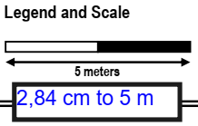
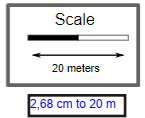
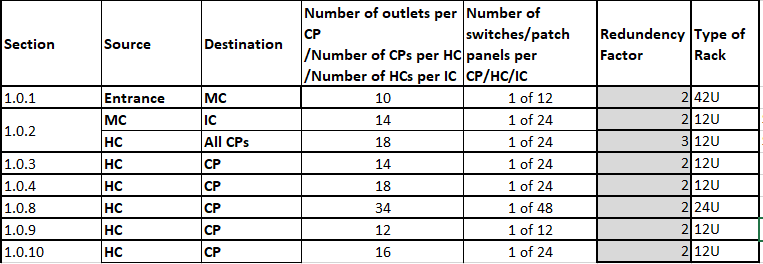
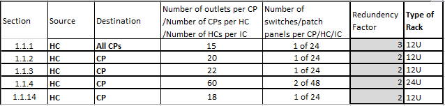

# RCOMP 2021-2022 Project - Sprint 1 - Building 1 - 1151399
===========================================

## Analysing Steps for Building 1
* [General Information](#general-information)
* [Analyze base buidling](#building-analysis)
* [Take measurements of both floors](#building-1-measurements)
* [Decide where all equipment should be placed in the building](#equipment-placing-building-1)
* [Represent the cable structure in the planning images](#cable-structure-building-1)
* [Cable calculation](#cable-calculation)
* [Equipment used](#equipment-used)

---
# **General Information** 

###  Measure Tool

* [Foxit PDF Reader](https://www.foxit.com/pdf-reader/) - The images have been measured directly in the given pdf file with the measuring tool.

### Calculations Made

* All calculations were made with an excel sheet in order to facilitate the proccess in case there's a need to change any information about the plant and equipment needed [calculations file](Attachments/Building_1.xlsx).

### Scale used

* Using the given scale in the pdf file, foxit allows us to measure the scale and get the correct one for the document.

---

# **Building analysis** 

Building 1 is a 2 floor building with 10 rooms plus 2 WC on the ground floor and 14 rooms plus 2 WC. Both floors are asymetrical.

### Floor 0
---

* As we can see from the image floor 0 has 10 rooms (ranging from 1.0.1 to 1.0.10) and is indicated to us that room 1.0.2 is the designated datacentre;
* We will hold the MC, IC and HC equipment in the Datacentre.
* The floor has underfloor raceways passing through every room, we will be passing our cable through there.
* Room 1.0.1 has the entering raceways for the fiber coming in and out of the campus. It also connects floor 0 to floor 1.

### Floor 1
---

* Floor 1 has 14 rooms and 2 WCs. We have a symmetrical block of 10 rooms in the middle of it.
* It is meantioned that this upper floor as a removable ceiling with 0.5 meters of space, which we will make use to pass our cables between rooms and hallway;
* The cables from the datacentre, has mentioned previously, will come through room 1.0.1 to 1.1.1.
* The cables will go from the room 1.1.1 to the rest of the floor through the ceiling.

---

# **Building 1 Measurements** 
**All the calculations here presented are in the Excel sheet**

The amount of outlets needed per room is calculated using the rule meantioned in the class's pdf that says, " there should be at least 2 outlets each 10m²".

As mentioned previously, all of the measurements have been taken directly from the pdf. The dimensions presented below, despite having some error associated with them, have absolutely acceptable values and so, we can consider the results to be accurate.

### Floor 0
---

| Room Name | Length(cm) | Width(cm) | Length(m) | Width(m) | Height(m) | Area(m²) | Nº Outlets |
| --------- | ---------- | --------- | --------- | -------- | --------- | -------- | ---------- |
| 1.0.1     | 11,48      | 5,30      | 6,52      | 3,01     | 4         | 19,7     | 4          |
| 1.0.2     | 11,48      | 7,78      | 6,52      | 4,42     | 4         | 28,9     | 6          |
| 1.0.3     | 11,48      | 7,73      | 6,52      | 4,39     | 4         | 28,7     | 6          |
| 1.0.4     | 11,48      | 11,69     | 6,52      | 6,64     | 4         | 43,3     | 9          |
| 1.0.5     | 8,70       | 5,35      | 4,94      | 3,04     | 4         | 15,1     | 4          |
| 1.0.6     | 8,70       | 5,30      | 4,94      | 3,01     | 4         | 14,9     | 3          |
| 1.0.7     | 8,70       | 5,30      | 4,94      | 3,01     | 4         | 14,9     | 3          |
| 1.0.8     | 8,70       | 8,73      | 4,94      | 4,96     | 4         | 24,6     | 5          |
| 1.0.9     | 8,20       | 10,21     | 4,66      | 5,80     | 4         | 27,1     | 6          |
| 1.0.10    | 12,52      | 10,21     | 7,11      | 5,80     | 4         | 41,3     | 9          |

### Floor 1
---
| Room Name | Length(cm) | Width(cm) | Length(m) | Width(m) | Height(m) | Area(m²) | Nº Outlets |
| --------- | ---------- | --------- | --------- | -------- | --------- | -------- | ---------- |
| 1.1.1     | 11,55      | 5,26      | 6,56      | 2,99     | 2,5       | 19,7     | 4          |
| 1.1.2     | 11,55      | 13,06     | 6,56      | 7,42     | 2,5       | 48,7     | 10         |
| 1.1.3     | 11,55      | 14,52     | 6,56      | 8,25     | 2,5       | 54,2     | 11         |
| 1.1.4     | 8,73       | 4,93      | 4,96      | 2,80     | 2,5       | 13,9     | 3          |
| 1.1.5     | 8,73       | 4,93      | 4,96      | 2,80     | 2,5       | 13,9     | 3          |
| 1.1.6     | 8,73       | 4,93      | 4,96      | 2,80     | 2,5       | 13,9     | 3          |
| 1.1.7     | 8,73       | 4,93      | 4,96      | 2,80     | 2,5       | 13,9     | 3          |
| 1.1.8     | 8,73       | 4,93      | 4,96      | 2,80     | 2,5       | 13,9     | 3          |
| 1.1.9     | 8,73       | 4,93      | 4,96      | 2,80     | 2,5       | 13,9     | 3          |
| 1.1.10    | 8,73       | 4,93      | 4,96      | 2,80     | 2,5       | 13,9     | 3          |
| 1.1.11    | 8,73       | 4,93      | 4,96      | 2,80     | 2,5       | 13,9     | 3          |
| 1.1.12    | 8,73       | 4,93      | 4,96      | 2,80     | 2,5       | 13,9     | 3          |
| 1.1.13    | 8,73       | 4,93      | 4,96      | 2,80     | 2,5       | 13,9     | 3          |
| 1.1.14    | 12,48      | 10,18     | 7,09      | 5,78     | 2,5       | 41       | 9          |

---

# **Equipment placing Building 1** 

* The positioning of the outlets throughtout all the rooms in the building has been done considering that an equipment positioned anywhere in the room should have an available outlet for its use at a maximum of 3 meters of distance.

* This building equipment will be represented in the following way:

* The grey blocks represent Rack equipments, they are all represented with their function on them. (MC/IC/HC/CP)

### **Building 1 Floor 0**
---

* The position of the MC, IC and HC is, in a way, arbitrary. The drawing, given it isn't representing the real dimensions of the equipment, might not even allow us to position the racks next to eachother in the disposition presented. Either way, it is not worrying because we have considered a safety dimensioning coeficient for cables.

* Rooms 1.0.3, 1.0.4, 1.0.8 to 1.0.10 will hold a Concilation Point in the room. The CP positioned in room 1.0.8 will hold all of the connections for the outlets in 1.0.5 to 1.0.7.

* All of the CPs ought to be positioned in either the corner of the room, above the raceway opening to allow a more direct connection, saving cable and room space as much as possible. Only in rooms 1.0.9 and 10 we fulfill just one of that criteria, we place the CPs above the raceway opening around the middle of a wall.

* The outlets have been distributed considering five things: 
   * Symmetric distribution;
   * Equal distance between them;
   * 3 m rule;
   * Not get blocked by a door's opening;
   * Cable saving.

* The outlets presented over the raceway, in the middle of rooms 1.0.4 and 1.0.10 have been positioned there to save cable, as it is almost in line with the raceway openings, and also go by the 3 m rule.

* The access point should be positioned in the middle of the floor. Why? Since it has a range of 50 m, it easily covers the entirety of the floor. The red circle in the drawing is representing the range of it and it is not represented accurately as I could not draw a circle with a radius superior to the width of an A4 page. It still had around 20 m radius to go.

* This floor will have a total of 46 outlets plus one dedicated for the access point.

### **Building 1 Floor 1**
---

* The HC equipment has to be positioned in room 1.1.1 as it is the room with the cable raceways from floor 0. Again, it should be positioned in the upper left corner in order to use the least space possible.

* In this floor the raceways are through the ceiling, it is great because it gives us more freedom to pass cable through.

* We will only have 4 Consolidation Points, in rooms 1.1.2 to 1.1.4 and in room 1.1.14.

* The CP positioned in 1.1.4 will be responsible for the connections to the outlets of rooms from 1.1.4 to 1.1.13. Possibly we could have divided this into two CPs but it seems like it might be a common area, in a way it might be better this way in terms of future configurations.

* The idea in the positioning of the outputs in walls that have doors is that we should occupy that space leaving equal space to each side in case it allows us only 1 outlet, or have equally distanced outlets positioned along the wall.

* The outputs positioned in the middle of 1.1.2 and 1.1.3 were needed to go by the rule of the 3 m. The idea behind those is that the cable comes down from the ceiling into the output. It could also be a good idea to have the outlet actually positioned in the ceiling and then just have a cable come down from it. Whatever is comfortable in construction and in use should be opted.

* We could have considered an even number of outlets per room but I do not believe they are needed in some cases. Lets consider roms from 1.1.4 to 1.1.13. Those rooms are considerably small comparing to others, which leds us to think that they might be small offices. In small offices, there is only usually a computer on a desk. Given that, 3 outlets are more than sufficient even if that is not the case.

* The access point, again, will be positioned in the middle of the floor, in room 1.1.11. 

* This floor will have a total of 60 outlets plus one dedicated for the access point.

---
# **Cable Structure Building 1** 
--- 

The cabling in this building will be represented the following way:

---

* Every cable is represented in the image, as requested.

* Cables connecting the Horizontal cross-connect to the consolidation point are represented in a single line but they are thicker than the rest of the cables.

* Cables that are coming from the consolidation points will be represented with a dashed line.

* Thicker dashed lines represent 3 or more cables coming from the CP. Sometimes, in order not to make the drawing heavy, we opted to use a thicker line.

* The cable connection to the outlets might not always be easily visible, a zoom in might be required.

---
### **Building 1 Floor 0**

---

### **Building 1 Floor 1**

---
# Cable Calculation 

* The cable length measurements were made with the tool referenced in the general information and the calculation needed was made with the Excel sheet also referenced in the general information.

* The height of each floor was taken account which means
    * in floor 0 an extra 1 meter of cable will be used from the floor passageway until the wall's raceway is reached;
    * in floor 1 an extra 1.5 meter of cable will be used from the ceilling to the wall's raceway.
    * The cables going from floor 0 IC to floor 1 HC take in consideration the height of 4 meters of the floor.

* We have considered an overdimensioning coeficient of 20% in order to always have a good margin of error. The good thing about cables is that you always just cut it. If you end up using less than you actually thought, you can save it and/or sell it.

* We have also rounded to the unit, it is easier to buy 1 m of cable than it is to buy 0.99 m.

* The dimensions considered to every calculation are presented in the tables below.

---
### Floor 0
---

| Section     | Source   | Destination | Cable length without height                       | Auxiliary calculations            | Length with height of 1 m | Length with overdimension coeficient of 20% | Length with excess rounding to the unit |
| ----------- | -------- | ----------- | ------------------------------------------------- | --------------------------------- | ------------------------- | ------------------------------------------- | --------------------------------------- |
| 1.0.1       | Entrance | MC          | 4,30                                              | Round up                          | 5,30                      | 6,36                                        | 7,00                                    |
| 1.0.2       | MC       | IC          | 0,50                                              | Round up                          | 1,50                      | 1,80                                        | 2,00                                    |
|| IC          | HC       | 0,50        | Round up                                          | 1,50                              | 1,80                      | 2,00                                        |
|| HC          | All CPs  |             |                                                   |                                   |                           |                                             |
| 1.0.3       | HC       | CP          | 2,00                                              | Round up                          | 3,00                      | 3,60                                        | 4,00                                    |
|| CP          | 1.0.3.1  | 4,95        | (3/4)\*6,6                                        | 5,95                              | 7,14                      | 8,00                                        |
|| CP          | 1.0.3.2  | 3,30        | (2/4)\*6,6                                        | 4,30                              | 5,16                      | 6,00                                        |
|| CP          | 1.0.3.3  | 1,65        | (1/4)\*6,6                                        | 2,65                              | 3,18                      | 4,00                                        |
|| CP          | 1.0.3.4  | 2,21        | 4,42/2                                            | 3,21                              | 3,85                      | 4,00                                        |
|| CP          | 1.0.3.5  | 6,07        | 4,42+((1/4)\*6,6)                                 | 7,07                              | 8,48                      | 9,00                                        |
|| CP          | 1.0.3.6  | 7,72        | 4,42+((2/4)\*6,6)                                 | 8,72                              | 10,46                     | 11,00                                       |
|| CP          | 1.0.3.7  | 9,37        | 4,42+((3/4)\*6,6)                                 | 10,37                             | 12,44                     | 13,00                                       |
| 1.0.4       | HC       | CP          | 6,80                                              | 2+4,42+0,38                       | 7,80                      | 9,36                                        | 10,00                                   |
|| CP          | 1.0.4.1  | 2,20        | (1/3)\*6,6                                        | 3,20                              | 3,84                      | 4,00                                        |
|| CP          | 1.0.4.2  | 4,40        | (2/3)\*6,6                                        | 5,40                              | 6,48                      | 7,00                                        |
|| CP          | 1.0.4.3  | 1,45        | (1/3)\*4,34                                       | 2,45                              | 2,94                      | 3,00                                        |
|| CP          | 1.0.4.4  | 2,89        | (2/3)\*4,34                                       | 3,89                              | 4,67                      | 5,00                                        |
|| CP          | 1.0.4.5  | 5,49        | 4,34+(6,64-4,34)/2                                | 6,49                              | 7,79                      | 8,00                                        |
|| CP          | 1.0.4.6  | 8,84        | (1/3)\*6,6 + 6,64                                 | 9,84                              | 11,81                     | 12,00                                       |
|| CP          | 1.0.4.7  | 11,04       | (2/3)\*6,6 + 6,64                                 | 12,04                             | 14,45                     | 15,00                                       |
|| CP          | 1.0.4.8  | 6,54        | (1/3)\*6,6 + 4,34                                 | 7,54                              | 9,05                      | 10,00                                       |
|| CP          | 1.0.4.9  | 8,74        | (2/3)\*6,6 + 4,34                                 | 9,74                              | 11,69                     | 12,00                                       |
| 1.0.8       | HC       | CP          | 22,21                                             | 4,42+4,34+6,6+1,89+4,96           | 23,21                     | 27,85                                       | 28,00                                   |
|| CP          | 1.0.8.1  | 6,59        | 4,94+(1/3)\*4,96                                  | 7,59                              | 9,11                      | 10,00                                       |
|| CP          | 1.0.8.2  | 8,25        | 4,94+(2/3)\*4,96                                  | 9,25                              | 11,10                     | 12,00                                       |
|| CP          | 1.0.8.3  | 3,31        | (2/3)\*4,96                                       | 4,31                              | 5,17                      | 6,00                                        |
|| CP          | 1.0.8.4  | 1,65        | (1/3)\*4,96                                       | 2,65                              | 3,18                      | 4,00                                        |
|| CP          | 1.0.8.5  | 1,22        | 2,44/2                                            | 2,22                              | 2,66                      | 3,00                                        |
| 1.0.7       | CP       | 1.0.7.1     | 9,68                                              | 4,94+3,09+(1/3)\*4,96             | 10,68                     | 12,82                                       | 13,00                                   |
|| CP          | 1.0.7.2  | 11,34       | 4,94+3,09+(2/3)\*4,96                             | 12,34                             | 14,80                     | 15,00                                       |
|| CP          | 1.0.7.3  | 8,25        | 4,94+(2/3)\*4,96                                  | 9,25                              | 11,10                     | 12,00                                       |
|| CP          | 1.0.7.4  | 6,59        | 4,94+(1/3)\*4,96                                  | 7,59                              | 9,11                      | 10,00                                       |
|| HC          | AP       | 31,46       | 2+4,42+0,38+4,34+6,6+1,89+0,38+4,96+4,94+(3,09/2) | 32,46                             | 38,95                     | 39,00                                       |
| 1.0.6       | CP       | 1.0.6.1     | 12,77                                             | 4,94+2\*3,09+(1/3)\*4,96          | 13,77                     | 16,53                                       | 17,00                                   |
|| CP          | 1.0.6.2  | 14,43       | 4,94+2\*3,09+(2/3)\*4,96                          | 15,43                             | 18,51                     | 19,00                                       |
|| CP          | 1.0.6.3  | 11,34       | 4,94+3,09+(2/3)\*4,96                             | 12,34                             | 14,80                     | 15,00                                       |
|| CP          | 1.0.6.4  | 9,68        | 4,94+3,09+(1/3)\*4,96                             | 10,68                             | 12,82                     | 13,00                                       |
| 1.0.5       | CP       | 1.0.5.1     | 15,86                                             | 4,94+3\*3,09+(1/3)\*4,96          | 16,86                     | 20,24                                       | 21,00                                   |
|| CP          | 1.0.5.2  | 17,52       | 4,94+3\*3,09+(2/3)\*4,96                          | 18,52                             | 22,22                     | 23,00                                       |
|| CP          | 1.0.5.3  | 14,43       | 4,94+2\*3,09+(2/3)\*4,96                          | 15,43                             | 18,51                     | 19,00                                       |
|| CP          | 1.0.5.4  | 12,77       | 4,94+2\*3,09+(1/3)\*4,96                          | 13,77                             | 16,53                     | 17,00                                       |
| 1.0.9       | HC       | CP          | 24,74                                             | 4,42+4,34+6,6+1,89+4,96+2,53      | 25,74                     | 30,89                                       | 31,00                                   |
|| CP          | 1.0.9.1  | 5,11        | 3,60+3,01/2                                       | 6,11                              | 7,33                      | 8,00                                        |
|| CP          | 1.0.9.2  | 1,66        | 3,6-(1/3)\*5,81                                   | 2,66                              | 3,20                      | 4,00                                        |
|| CP          | 1.0.9.3  | 0,27        | (5,81-3,6)-(1/3)\*5,81                            | 1,27                              | 1,53                      | 2,00                                        |
|| CP          | 1.0.9.4  | 4,54        | (5,81-3,6)+4,65/2                                 | 5,54                              | 6,64                      | 7,00                                        |
|| CP          | 1.0.9.5  | 4,92        | (5,81-3,6)-(1/3)\*5,81+4,65                       | 5,92                              | 7,11                      | 8,00                                        |
|| CP          | 1.0.9.6  | 6,31        | 3,6-(1/3)\*5,81+4,65                              | 7,31                              | 8,78                      | 9,00                                        |
| 1.0.10      | HC       | CP          | 29,39                                             | 4,42+4,34+6,6+1,89+4,96+2,53+4,65 | 30,39                     | 36,47                                       | 37,00                                   |
|| CP          | 1.0.10.1 | 13,15       | 7,16+3,6+(1/3)\*7,16                              | 14,15                             | 16,98                     | 17,00                                       |
|| CP          | 1.0.10.2 | 15,53       | 7,16+3,6+(2/3)\*7,16                              | 16,53                             | 19,84                     | 20,00                                       |
|| CP          | 1.0.10.3 | 1,80        | 3,6/2                                             | 2,80                              | 3,36                      | 4,00                                        |
|| CP          | 1.0.10.4 | 4,00        | (5,81-3,6)+(1/4)\*7,16                            | 5,00                              | 6,00                      | 6,00                                        |
|| CP          | 1.0.10.5 | 5,79        | (5,81-3,6)+(2/4)\*7,16                            | 6,79                              | 8,15                      | 9,00                                        |
|| CP          | 1.0.10.6 | 11,16       | 7,16+(5,81-3,6)+(1/4)\*7,16                       | 12,16                             | 14,59                     | 15,00                                       |
|| CP          | 1.0.10.7 | 2,39        | 7,16\*(1/3)                                       | 3,39                              | 4,06                      | 5,00                                        |
|| CP          | 1.0.10.8 | 4,77        | 7,16\*(2/3)                                       | 5,77                              | 6,93                      | 7,00                                        |
| Total CAT7  |          |             |                                                   |                                   | 506,54                    | 607,85                                      | 634,00                                  |
| Total Fiber |          |             |                                                   |                                   | 5,30                      | 6,36                                        | 7,00                                    |

---
---
### Floor 1
---
| Section | Source   | Destination | Cable length without height         | Auxiliary calculations                | Length with height of 1,5 m | Length with overdimension coeficient of 20% | Length with excess rounding to the unit |
| ------- | -------- | ----------- | ----------------------------------- | ------------------------------------- | --------------------------- | ------------------------------------------- | --------------------------------------- |
| 1.1.1   | IC       | HC          | 8,28                                | 4,28+4                                | 9,78                        | 11,74                                       | 12,00                                   |
| HC      | All CPs  |             |                                     |                                       |                             |                                             |
| 1.1.2   | HC       | CP          | 0,50                                | 3,05+0,28                             | 2,00                        | 2,40                                        | 3,00                                    |
|| CP      | 1.1.1.1  | 4,40        | 6,6\*(2/3)                          | 5,90                                  | 7,08                        | 8,00                                        |
|| CP      | 1.1.1.2  | 2,20        | 6,6\*(1/3)                          | 3,70                                  | 4,44                        | 5,00                                        |
|| CP      | 1.1.1.3  | 1,87        | 7,46\*(1/4)                         | 3,37                                  | 4,04                        | 5,00                                        |
|| CP      | 1.1.1.4  | 3,73        | 7,46\*(2/4)                         | 5,23                                  | 6,28                        | 7,00                                        |
|| CP      | 1.1.1.5  | 5,60        | 7,46\*(3/4)                         | 7,10                                  | 8,51                        | 9,00                                        |
|| CP      | 1.1.1.6  | 9,66        | 7,46+6,60\*(1/3)                    | 11,16                                 | 13,39                       | 14,00                                       |
|| CP      | 1.1.1.7  | 11,86       | 7,46+6,60\*(2/3)                    | 13,36                                 | 16,03                       | 17,00                                       |
|| CP      | 1.1.1.8  | 10,45       | 6,60+5,78\*(2/3)                    | 11,95                                 | 14,34                       | 15,00                                       |
|| CP      | 1.1.1.9  | 8,53        | 6,60+5,78\*(1/3)                    | 10,03                                 | 12,03                       | 13,00                                       |
|| CP      | 1.1.1.10 | 7,03        | 7,46/2+6,60/2                       | 8,53                                  | 10,24                       | 11,00                                       |
| 1.1.3   | HC       | CP          | 11,07                               | 3,05+0,28+7,46+0,28                   | 12,57                       | 15,08                                       | 16,00                                   |
|| CP      | 1.1.3.1  | 4,40        | 6,6\*(2/3)                          | 5,90                                  | 7,08                        | 8,00                                        |
|| CP      | 1.1.3.2  | 2,20        | 6,6\*(1/3)                          | 3,70                                  | 4,44                        | 5,00                                        |
|| CP      | 1.1.3.3  | 2,07        | 8,26\*(1/4)                         | 3,57                                  | 4,28                        | 5,00                                        |
|| CP      | 1.1.3.4  | 4,13        | 8,26\*(2/4)                         | 5,63                                  | 6,76                        | 7,00                                        |
|| CP      | 1.1.3.5  | 6,20        | 8,26\*(3/4)                         | 7,70                                  | 9,23                        | 10,00                                       |
|| CP      | 1.1.3.6  | 10,46       | 8,26+6,6\*(1/3)                     | 11,96                                 | 14,35                       | 15,00                                       |
|| CP      | 1.1.3.7  | 12,66       | 8,26+6,6\*(2/3)                     | 14,16                                 | 16,99                       | 17,00                                       |
|| CP      | 1.1.3.8  | 17,06       | 8,26+6,6+6,6\*(1/3)                 | 18,56                                 | 22,27                       | 23,00                                       |
|| CP      | 1.1.3.9  | 19,26       | 8,26+6,6+6,6\*(2/3)                 | 20,76                                 | 24,91                       | 25,00                                       |
|| CP      | 1.1.3.10 | 6,05        | 8,26\*(1/3)+6,6/2                   | 7,55                                  | 9,06                        | 10,00                                       |
|| CP      | 1.1.3.11 | 8,81        | 8,26\*(2/3)+6,6/2                   | 10,31                                 | 12,37                       | 13,00                                       |
| 1.1.4   | HC       | CP          | 11,01                               | 6,6+0,28+1,91+0,28+1,94               | 12,51                       | 15,01                                       | 16,00                                   |
|| CP      | 1.1.4.1  | 1,63        | 3,26/2                              | 3,13                                  | 3,76                        | 4,00                                        |
|| CP      | 1.1.4.2  | 4,41        | 2,74+5\*(1/3)                       | 5,91                                  | 7,09                        | 8,00                                        |
|| CP      | 1.1.4.3  | 6,07        | 2,74+5\*(2/3)                       | 7,57                                  | 9,09                        | 10,00                                       |
| 1.1.5   | CP       | 1.1.5.1     | 5,52                                | 2,74+0,28+5/2                         | 7,02                        | 8,42                                        | 9,00                                    |
|| CP      | 1.1.5.2  | 7,43        | 2,74\*2+0,28+5\*(1/3)               | 8,93                                  | 10,71                       | 11,00                                       |
|| CP      | 1.1.5.3  | 9,09        | 2,74\*2+0,28+5\*(2/3)               | 10,59                                 | 12,71                       | 13,00                                       |
| 1.1.6   | CP       | 1.1.6.1     | 7,71                                | 2,74\*2+0,28\*2+5\*(1/3)              | 9,21                        | 11,05                                       | 12,00                                   |
|| CP      | 1.1.6.2  | 9,37        | 2,74\*2+0,28\*2+5\*(2/3)            | 10,87                                 | 13,05                       | 14,00                                       |
|| CP      | 1.1.6.3  | 11,28       | 2,74\*3+0,28\*2+5/2                 | 12,78                                 | 15,34                       | 16,00                                       |
| 1.1.7   | CP       | 1.1.7.1     | 11,56                               | 2,74\*3+0,28\*3+5/2                   | 13,06                       | 15,67                                       | 16,00                                   |
|| CP      | 1.1.7.2  | 13,47       | 2,74\*4+0,28\*3+5\*(1/3)            | 14,97                                 | 17,96                       | 18,00                                       |
|| CP      | 1.1.7.3  | 15,13       | 2,74\*4+0,28\*3+5\*(2/3)            | 16,63                                 | 19,96                       | 20,00                                       |
| 1.1.8   | CP       | 1.1.8.1     | 15,41                               | 2,74\*4+0,28\*4+5\*(2/3)              | 16,91                       | 20,30                                       | 21,00                                   |
|| CP      | 1.1.8.2  | 13,75       | 2,74\*4+0,28\*4+5\*(1/3)            | 15,25                                 | 18,30                       | 19,00                                       |
|| CP      | 1.1.8.3  | 16,45       | 2,74\*5+0,28\*4+3,26/2              | 17,95                                 | 21,54                       | 22,00                                       |
| 1.1.9   | CP       | 1.1.9.1     | 8,67                                | 5+0,28+(5-3,23+(3,23/2))              | 10,17                       | 12,20                                       | 13,00                                   |
|| CP      | 1.1.9.2  | 9,69        | 2,74+5+0,28+5\*(1/3)                | 11,19                                 | 13,42                       | 14,00                                       |
|| CP      | 1.1.9.3  | 11,35       | 2,74+5+0,28+5\*(2/3)                | 12,85                                 | 15,42                       | 16,00                                       |
| 1.1.10  | CP       | 1.1.10.1    | 10,80                               | 2,74+0,28\*2+5+5/2                    | 12,30                       | 14,76                                       | 15,00                                   |
|| CP      | 1.1.10.2 | 12,71       | 2,74\*2+0,28\*2+5+5\*(1/3)          | 14,21                                 | 17,05                       | 18,00                                       |
|| CP      | 1.1.10.3 | 14,37       | 2,74\*2+0,28\*2+5+5\*(2/3)          | 15,87                                 | 19,05                       | 20,00                                       |
| 1.1.11  | CP       | 1.1.11.1    | 14,65                               | 2,74\*2+0,28\*3+5+5\*(2/3)            | 16,15                       | 19,38                                       | 20,00                                   |
|| CP      | 1.1.11.2 | 15,73       | 2,74\*3+0,28\*3+5+5\*(1/3)          | 17,23                                 | 20,67                       | 21,00                                       |
|| CP      | 1.1.11.3 | 16,56       | 2,74\*3+0,28\*3+5+5/2               | 18,06                                 | 21,67                       | 22,00                                       |
| 1.1.12  | CP       | 1.1.12.1    | 16,84                               | 2,74\*3+0,28\*4+5+5/2                 | 18,34                       | 22,01                                       | 23,00                                   |
|| CP      | 1.1.12.2 | 18,75       | 2,74\*4+0,28\*4+5+5\*(1/3)          | 20,25                                 | 24,30                       | 25,00                                       |
|| CP      | 1.1.12.3 | 20,41       | 2,74\*4+0,28\*4+5+5\*(2/3)          | 21,91                                 | 26,30                       | 27,00                                       |
| 1.1.13  | CP       | 1.1.13.1    | 20,69                               | 2,74\*4+0,28\*5+5+5\*(2/3)            | 22,19                       | 26,63                                       | 27,00                                   |
|| CP      | 1.1.13.2 | 19,03       | 2,74\*4+0,28\*5+5+5\*(1/3)          | 20,53                                 | 24,63                       | 25,00                                       |
|| CP      | 1.1.13.3 | 23,49       | 2,74\*5+0,28\*5+5+(5-3,23+(3,23/2)) | 24,99                                 | 29,98                       | 30,00                                       |
| 1.1.14  | HC       | CP          | 21,79                               | 6,6+0,28+1,91+0,28+5+0,28+5+2,16+0,28 | 23,29                       | 27,95                                       | 28,00                                   |
|| CP      | 1.1.14.1 | 14,78       | 7,14+5,82+5,46\*(1/3)               | 16,28                                 | 19,54                       | 20,00                                       |
|| CP      | 1.1.14.2 | 16,60       | 7,14+5,82+5,46\*(2/3)               | 18,10                                 | 21,72                       | 22,00                                       |
|| CP      | 1.1.14.3 | 3,88        | 5,82\*(2/3)                         | 5,38                                  | 6,46                        | 7,00                                        |
|| CP      | 1.1.14.4 | 1,94        | 5,82\*(1/3)                         | 3,44                                  | 4,13                        | 5,00                                        |
|| CP      | 1.1.14.5 | 1,79        | 7,14\*(1/4)                         | 3,29                                  | 3,94                        | 4,00                                        |
|| CP      | 1.1.14.6 | 3,57        | 7,14\*(2/4)                         | 5,07                                  | 6,08                        | 7,00                                        |
|| CP      | 1.1.14.7 | 5,36        | 7,14\*(3/4)                         | 6,86                                  | 8,23                        | 9,00                                        |
|| CP      | 1.1.14.8 | 9,08        | 7,14+5,82\*(1/3)                    | 10,58                                 | 12,70                       | 13,00                                       |
|| CP      | 1.1.14.9 | 11,02       | 7,14+5,82\*(2/3)                    | 12,52                                 | 15,02                       | 16,00                                       |
| Total   |          |             |                                     |                                       | 749,00                      | 898,80                                      | 937,00                                  |

---
## Total cable needed for the building
---
Summing both floors, 1571 m will be needed for the whole building.
---
# Equipment Used 
---

* The use 12U Racks, 1U Switchs and 1U Patch panels when the connection limit isn't reached is to be able to provide extendebility to the overall structure.

* We used 42U, 24U and 12U Racks.

* Since we are only using the number of patch cords which are used by outlets then the number of Patch cords, Female RJ45 and Male RJ45 is the same.

* We will have fiber connectors to the MC and from the MC to the IC.

## Measures of equipment:
|                          | Building 1 |
| ------------------------ | ---------- |
| CAT7                     | 1571,00    |
| Fiber                    | 9,00       |
| Fiber - Campus           | \-         |
| Outlets                  | 107        |
| Switch/Patch Panel of 12 | 3          |
| Switch/Patch Panel of 24 | 10         |
| Switch/Patch Panel of 48 | 3          |
| 6U Rack                  | 0          |
| 12U Rack                 | 10         |
| 24U Rack                 | 2          |
| 42U Rack                 | 1          |
| Router                   | 1          |
| Server                   | 1          |
| Access Points            | 2          |
| UPS                      | 1          |
| Patch Cords              | 118        |
| Female RJ45              | 107        |
| Subscriber Connector     | 1          |
| Lucent Connector         | 2          |

## Total cable needed for the Campus
---
The dimensioning of the cable was done considering the following measures of the campus:

We considered two "networks", one that connects each of the buildings to the Main Connector:

| Source          | Destination     | Cable length | Auxiliary Calculations         | Length with overdimension coeficient of 20% | Length with excess rounding to the unit |
| --------------- | --------------- | ------------ | ------------------------------ | ------------------------------------------- | --------------------------------------- |
| MC - Building 1 | IC - Building 2 | 44,71        | 2,56\*2+39,59                  | 53,652                                      | 54,00                                   |
| MC - Building 1 | IC - Building 3 | 101,14       | 2,56\*2+39,59+56,43            | 121,368                                     | 122,00                                  |
| MC - Building 1 | IC - Building 4 | 169,32       | 2,56\*2+6,46+53,60+47,72+56,42 | 203,184                                     | 204,00                                  |
| MC - Building 1 | IC - Building 5 | 112,90       | 2,56\*2+6,46+53,60+47,72       | 135,48                                      | 136,00                                  |
| Total           |                 | 428,07       |                                | 513,68                                      | 516,00                                  |

And another network of redundency that connects all of the buildings to eachother:

| Source          | Destination     | Cable length | Auxiliary Calculations         | Length with overdimension coeficient of 20% | Length with excess rounding to the unit |
| --------------- | --------------- | ------------ | ------------------------------ | ------------------------------------------- | --------------------------------------- |
| IC - Building 1 | IC - Building 2 | 44,71        | 2,56\*2+39,59                  | 53,652                                      | 54,00                                   |
| IC - Building 2 | IC - Building 3 | 61,55        | 2,56\*2+56,43                  | 73,86                                       | 74,00                                   |
| IC - Building 3 | IC - Building 4 | 68,50        | 2,56\*2+4,89\*2+53,60          | 82,2                                        | 83,00                                   |
| IC - Building 4 | IC - Building 5 | 61,54        | 2,56\*2+56,42                  | 73,848                                      | 74,00                                   |
| IC - Building 1 | IC - Building 3 | 101,14       | 2,56\*2+39,59+56,43            | 121,368                                     | 122,00                                  |
| IC - Building 2 | IC - Building 4 | 124,93       | 2,56\*2+56,43+4,89\*2+53,60    | 149,916                                     | 150,00                                  |
| IC - Building 3 | IC - Building 5 | 124,92       | 2,56\*2+4,89\*2+53,60+56,42    | 149,904                                     | 150,00                                  |
| IC - Building 1 | IC - Building 4 | 169,32       | 2,56\*2+6,46+53,60+47,72+56,42 | 203,184                                     | 204,00                                  |
| IC - Building 2 | IC - Building 5 | 154,16       | 2,56\*2+47,72\*2+53,6          | 184,992                                     | 185,00                                  |
| IC - Building 1 | IC - Building 5 | 112,90       | 2,56\*2+6,46+53,60+47,72       | 135,48                                      | 136,00                                  |
| Total           |                 | 236,30       |                                | 283,56                                      | 285,00                                  |

Considering this, we achieve a total quantity of fiber of 808,00 m. 

## Measures of equipment of the Campus:
|                          | Building 1 | Building 2 | Building 3 | Building 4 | Building 5 | Campus  |
| ------------------------ | ---------- | ---------- | ---------- | ---------- | ---------- | ------- |
| CAT7                     | 1571,00    | 1563       | 1670,1     | 1280       | 1578       | 7662,10 |
| Fiber                    | 9,00       | 12         | 85,5       | 38         | 25         | 169,50  |
| Fiber - Campus           | \-         | \-         | \-         | \-         | \-         | 808,00  |
| Outlets                  | 107        | 87         | 93         | 95         | 92         | 474,00  |
| Switch/Patch Panel of 12 | 3          | 1          | 0          | 0          | 2          | 6,00    |
| Switch/Patch Panel of 24 | 10         | 3          | 6          | 2          | 0          | 21,00   |
| Switch/Patch Panel of 48 | 3          | 3          | 4          | 6          | 4          | 20,00   |
| 6U Rack                  | 0          | 3          | 6          | 2          | 1          | 12,00   |
| 12U Rack                 | 10         | 4          | 5          | 7          | 5          | 31,00   |
| 24U Rack                 | 2          | 0          | 0          | 0          | 0          | 2,00    |
| 42U Rack                 | 1          | 0          | 0          | 0          | 0          | 1,00    |
| Router                   | 1          | 0          | 0          | 0          | 0          | 1,00    |
| Server                   | 1          | 0          | 0          | 0          | 0          | 1,00    |
| Access Points            | 2          | 2          | 2          | 2          | 2          | 10,00   |
| UPS                      | 1          | 0          | 0          | 0          | 0          | 1,00    |
| Patch Cords              | 118        | 127        | 121        | 127        | 104        | 597,00  |
| Female RJ45              | 107        | 87         | 93         | 95         | 92         | 474,00  |
| Subscriber Connector     | 1          | \-         | \-         | \-         | \-         | 1,00    |
| Lucent Connector         | 2          | 2          | 2          | 2          | 2          | 10,00   |