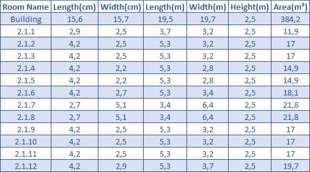

# RCOMP 2021-2022 Project - Sprint 1 - Building 2 - 1181350

## **Steps To Be Taken**
- General Information
- Analyze base building
- Take measurements of both floors
- Decide where all equipment should be placed in the building
- Represent the cable structure in the planning images
- Cable calculation
- Equipment used

---
## **General Information**

###  Measure Tool

- [ginifab - Virtual ruler on your image](https://www.ginifab.com/feeds/cm_to_inch/virtual_ruler_on_your_image.html) - The images used to measure were the "Plant_To_Measure" in [Floor 0](./Imgs/Floor_0/Plant_To_Measure.png) and [Floor 1](./Imgs/Floor_1/Plant_To_Measure.png) folders.
- [Photoshop](https://www.adobe.com/pt/products/photoshop.html) was used to take the cable measures, as it was more efficient to do all the small pieces. The photoshop project is in the attachments folder with named [Cable_Outlets_Positions](./Attachments/Cable_Outlets_Positions.psd).

### Calculations

- All the math involved was done in [Excel](https://www.microsoft.com/pt-pt/microsoft-365/excel) and is available to be consulted in the Attachments folder with the name [Building_2](./Attachments/Building_2.xlsx).

### Scale

- This scale was taken and calculated using the tools above.

    

### Legend

- The icons used in all the following images have this interpretation:

    

- The cable is identified by the following legend:

    
---
## **Building 2 - Floor 0**

- The base plant provided was the following one:

    

- The floor has 6 rooms numbered from **2.0.1** to **2.0.6**.
- As described by the client, the room **2.0.1** is the one chosen to be the storage room.
- The existing two **WC** rooms do not require an outlet, same for the **Hall** and room **2.0.1**.

### Dimensions 

- After measuring we obtained the following room dimensions:

    

- With these areas, we can now calculate the number of outlets per room:

    

## Outlets, IC, HC & CPs Positions

- The room **2.0.1** has the IC of the building and the HC of the floor.
- As shown before, we have 43 outlets in all six rooms, plus one for wireless, giving a total of 44 outlets on this floor.
- We decided to put 2 CP to aggregate them, one in room **2.0.3** and other on **2.0.4**.
- The CP on room **2.0.3** connecting to 26 outlets.
- The CP on room **2.0.4** connecting to 18 outlets.
- The following image shows where all of them are positioned:

    

- In terms of height, all the outlets are on floor level, same for the cable that is not in the raceways, and the CPs are 1 meter above the floor.

## Cable Structure 

### Main Cable

- IC, HC and CPs have one line that represents 3 cables. Except for the fiber cable that is only 2.
- All the cable travels through the raceways as shown below:
    
    

### Outlet Cable

- Each line from the CP represents the number of cable necessary for each room.
- The lines closer to the wall do not pass in the raceway but in the bottom of the wall.
- The wireless cable is the only cable that navigates in the ceiling.
    
    

## Cable Calculations

- All cables were measured individually in the [excel](./Attachments/Building_2.xlsx) but, a summary per room was made to simplify the presentation here.
- The total cable needed is 642.3 Meters.
- With a 20% excess consideration and rounded up to meters, we get a total of 771 Meters.

    

## Total Equipment 

Main structures to house all equipment necessary counts with 2 CPs and 1 IC that holds the HC too.

### IC / HC

- 1 Patch panel for fiber cable with 12 connections (1U).
- 1 Patch panel for CAT 7 cable with 24 connections (1U).
- The total server racks needed is 8U, so a 12U server is required.
- To connect patch panel to active equipment we need 11 patch cords. 

    

### 2.0.3 CP

- 1 Patch panel for CAT 7 cable with 48 connections (2U).
- The total server racks needed is 8U, so a 12U server is required.
- To connect patch panel to active equipment we need 28 patch cords. 
    
    

### 2.0.4 CP

- 1 Patch panel for CAT 7 cable with 48 connections (2U).
- The total server racks needed is 8U, so a 12U server is required.
- To connect patch panel to active equipment we need 22 patch cords. 

    

### Total

---

## **Building 2 - Floor 1**

- The base plant provided was the following one:

    

- The floor has 12 rooms numbered from **2.1.1** to **2.1.12**.
- As described by the client the room **2.1.1** is the one chosen to be the storage room.
- The existing 2 **WC** rooms do not require an outlet, same for the **Hall** and room **2.1.1**.

### Dimensions 

- After all measures and we have the following room dimensions:

    

- With those areas we can now calculate the number of outlets per room:

    

## Outlets, IC, HC & CPs Positions

- The room **2.1.1** has the HC of the floor.
- As showed before we have 44 outlets in all twelve rooms plus one for wireless, giving a total of 45 outlets on this floor.
- We decided to put 3 CP to aggregate them, one in room **2.1.4**, another in **2.1.8** and, another on **2.1.11**.
- The CP on room **2.1.4** connecting to 21 outlets.
- The CP on room **2.1.8** connecting to 14 outlets.
- The CP on room **2.1.11** connecting to 19 outlets.
- The following image shows where all of them are positioned:

    

- In terms of height, all the outlets are on floor level, same for the cable that is not in the ceiling, and the CPs are 1 meter above the floor.

## Cable Structure 

### Main Cable

- IC, HC and CPs have a line that represents 3 cables.
- All the cable passes in the raceways as shown below:
    
    

### Outlet Cable

- Each line from the CP represents the number of cable necessary for each room.
-    
    

## Cable Calculations

- All cables were measured individually in the [excel](./Attachments/Building_2.xlsx) but, a summary per room was made to simplify the presentation here.
- The total cable needed is 659.2 Meters.
- With a 20% excess consideration and rounded up to meters, we get a total of 792 Meters.

    

## Total Equipment 

Main structures to house all equipment necessary counts with 3 CPs and 1 HC.

### HC

- 1 Patch panel for CAT 7 cable with 24 connections (1U).
- The total server racks needed is 4U, so a 6U server is required.
- To connect patch panel to active equipment we need 12 patch cords. 

    

### 2.1.4 CP

- 1 Patch panel for CAT 7 cable with 48 connections (2U).
- The total server racks needed is 8U, so a 12U server is required.
- To connect patch panel to active equipment we need 21 patch cords. 
    
    

### 2.1.8 CP

- 1 Patch panel for CAT 7 cable with 24 connections (1U).
- The total server racks needed is 4U, so a 6U server is required.
- To connect patch panel to active equipment we need 14 patch cords. 

    

### 2.1.11 CP

- 1 Patch panel for CAT 7 cable with 24 connections (2U).
- The total server racks needed is 4U, so a 6U server is required.
- To connect patch panel to active equipment we need 19 patch cords. 

    

### Total

---

## Totals for the building

