# RCOMP 2021-2022 Project - Sprint 1 - Building 3 - 1181357
===========================================

## Analysing Steps for Building 3
* [General Information](#general-information)
* [Analyse base buidling](#building-analysis)
* [Take measurements of both floors](#building-4-measurements)
* [Decide where all equipment should be placed in the building](#equipment-placing-building-4)
* [Represent the cable structure in the planning images](#cable-structure-building-4)
* [Cable calculation](#cable-calculation)
* [Equipment used](#equipment-used)

---
# **General Information** 

###  Measure Tool

* [ginifab - Virtual ruler on your image](https://www.ginifab.com/feeds/cm_to_inch/virtual_ruler_on_your_image.html) - The images used to measure are these, [Floor 0](Imgs/Floor_0/Floor0.png) and [Floor 1](Imgs/Floor_1/Floor1.png).

### Calculations Made

* All calculations were made within Microsoft Excel in order to facilitate the proccess in case there's a need to change any information about the plant and equipment needed. The calculations found can be found in here: [calculations file](Attachments/Building_3.xlsx). In the calculations there are 4 sheet's: 
- Floor_0 (contains the measurements for floor 0 and the scale used)
- Floor_1 (contains the measurements for floor 1 and the scale used)
- Floor0_CableCalculations (contains the cable measurements for floor 0 and the scale used)
- Floor1_CableCalculations (contains the cable measurements for floor 1 and the scale used)

### Scale used

* Two different scales were used for the measurement of the buildings and also for measuring the cable length. This scale difference was used due to having two different image sizes for the
building measurements and the cable measurements.

Scale used for the measurements of the building:

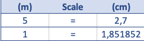

Scale used for the measurements of the cable lengths:

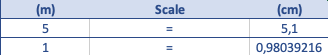

---

# **Building analysis** 

 - Building 3 is a 2 floor building with 9 rooms on floor 0 and 10 rooms on floor 1.
 - Both floors have an equipments room that can be used to store horizontal cross-connect's and intermediate cross-connect's.
 - Equipment room on floor 0 is at room 3.0.9.
 - Equipment room on floor 1 is at room 3.1.10. 
 - Floor 1 has a drop down ceiling that can be used to store cabiling and access-point's. 
 - The whole building requires a full wireless LAN Wi-fi network.

### Floor 0
---
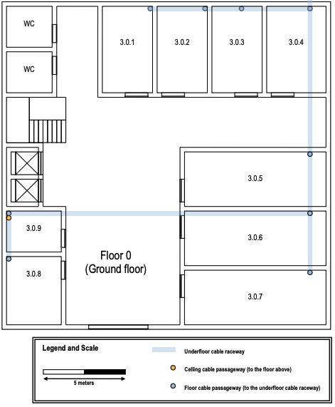

* Floor 0 has 9 rooms raging from 3.0.1 to 3.0.9.
* Since room 3.0.9 contains ceiling cable passageway and floor cable passageway, room 3.0.9 can be used as an equipment's room to hold the Horizontal Cross-Connect and the Intermediate Cross-Connect.
* Connection from the Main Cross-Connect has it's entrance point at room 3.0.4 and can be passed through rooms 3.0.4, 3.0.5, 3.0.6, 3.0.9 in order to reach an Intermediate Cross-Connect at the equipment's room(room 3.0.9);
* An Access Point can be placed at the upper corner of room 3.1.4 on the drop down ceiling in order to reach the most ammount of area.
* Consolidation Point's can be used to provide network access to two or more rooms at the same time.
* Connection's between outlet's and the network can be done by cables from the Consolidation Point's.
* Horizontal Cross-Connect can be used to provide network access to the Consolidation Point's.
* Cable redundancy can be used between Horizontal Cross-Connect and Consolidation Point's.

### Floor 1
---
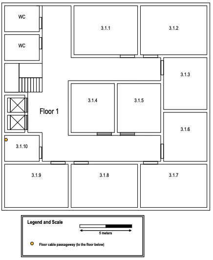

* Floor 1 has 10 rooms raging from 3.1.1 to 3.1.10.
* Since room 3.1.10 contains ceiling cable passageway, room 3.1.10 can be used as an equipment's room to hold an Horizontal Cross-Connect.
* Intermediate cross-connect might not be needed on this floor.
* The floor as a drop down ceiling which can be used to store cabling and access point's.
* An Access Point can be placed at the upper corner of room 3.0.5 to reach the most ammount of area.
* Consolidation Point's can be used to provide network access to two or more rooms at the same time.
* Connection's between outlet's and the network can be done by cables from the Consolidation Point's.
* Horizontal Cross-Connect can be used to provide network access to the Consolidation Point's.
* Cable redundancy can be used between Horizontal Cross-Connect and Consolidation Point's.
* Ceiling cable passageway's have to be created in order to pass the cables from the drop down ceiling into the rooms.

---

# **Building 3 Measurements** 
**All the calculations here presented are in the Excel sheet**

The amount of outlets needed per room is calculated using the rule meantioned in the class's pdf that says, "there should be at least 2 outlets each 10m²".

Scale used for the measurements:

### Floor 0
---
After calculating the measurements for floor 0 and applying the rule of 2 outlets per 10m² the following number of outlets was determined for each room:

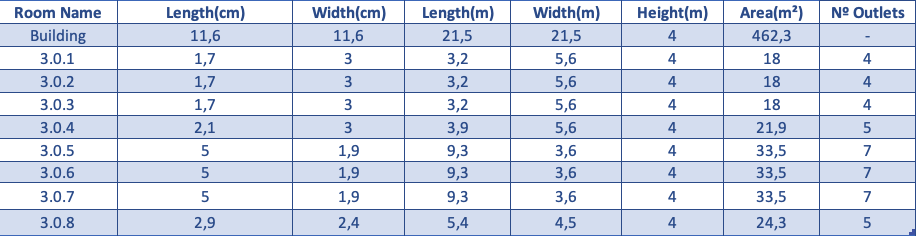

This means that a total of 43 outlets have to be used on Floor 0.

### Floor 1
---

After calculating the measurements for floor 1 and applying the rule of 2 outlets per 10m² the following number of outlets was determined for each room:

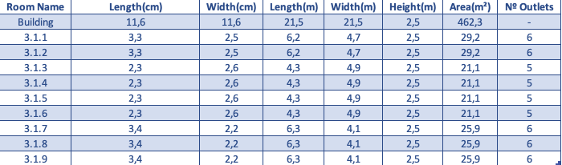

This means that a total of 50 outlets have to be used on Floor 1.

---

# **Equipment placing Building 3** 

* The positioning of the outlets throughtout all the rooms in the building took into account the rule that there shouldn't be a point larger than 3 meters within a room without an outlet.

* This building equipment will be represented in the following way:

### **Building 3 Floor 0**
---
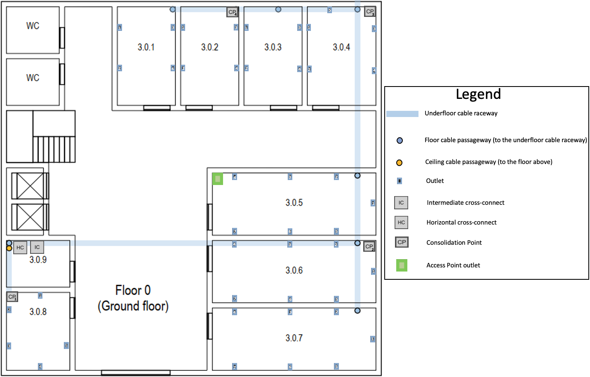

* Outlet's are placed equally or very similar on rooms with equal or similar size. Doing this allows to have a standardized outlet structure for the building.
* Outlet's are numbered within each room.
* Outlet's are positioned as far away as possible from doors.
* Horizontal Cross-Connect and Intermediate Cross-Connect are positioned on room 3.0.9 so this means that room 3.0.9 is used has an equipment's room.
* Consolidation points are spread out through the building and they are going to be used to provid the cabling for the outlet's. Due to the schematics of the floor and also the small outlet density on rooms 3.0.5, 3.0.6, 3.0.7 there is only one Consolidation Point for those 3 rooms but in other areas of the floor a Consolidation Point was placed that either serves 1 or 2 rooms at maximum.
* Access point outlet is placed at the top left corner of room 3.0.5. This position of the Access Point outlet places the Access Point at the middle of the building which allows the Access Point to reach to the most ammount of area possible with it's Wireless LAN. We found no need to place more than one Access Point outlet within the floor due to the fact the floor measures do not surpass the radius provided by the Access Point.

### **Building 3 Floor 1**
---
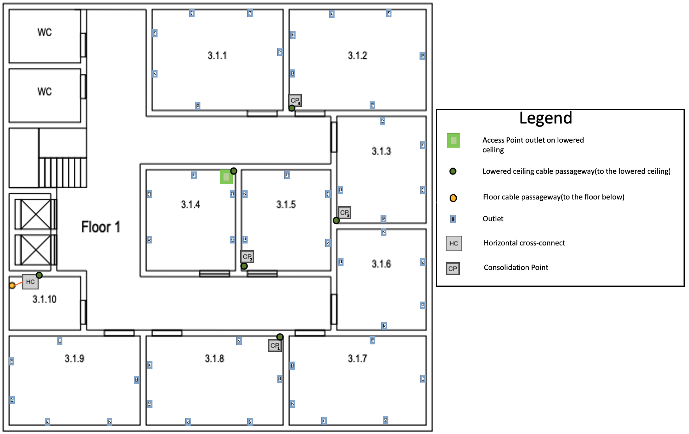

* Outlet's are placed equally or very similar on rooms with equal or similar size. Doing this allows to have a standardized outlet structure for the building.
* Outlet's are numbered within each room.
* Outlet's are positioned as far away as possible from doors.
* We found no need to place an Intermediate Cross-Connect on Floor 1 due to the lack of requirements for fiber cabling on this floor.
* Horizontal Cross-Connect is positioned on room 3.1.10 so this means that room 3.1.10 is used has an equipment's room.
* Consolidation points are spread out through the building and they are going to be used to provid the cabling for the outlet's. Due to the schematics of the floor and also the small outlet density on rooms 3.1.9, 3.1.8, 3.1.7 there is only one Consolidation Point for those 3 rooms but in other areas of the floor a Consolidation Point was placed that either serves 1 or 2 rooms at maximum.
* Consolidation points are always at the furthest corner from the door. Doing this decreases the probability of anyone messing with the Consolidation Point and also improves the overall asthetic of the room.
* The drop down ceiling of the building is used to store cabling and host an Access Point outlet.
* Due to using the drop down ceiling to store cabling and host of an Access Point outlet, lowered ceiling cable passageway's are used to direct the cabling from the drop down ceiling to the room's.
* Access point outlet is placed at drop down ceiling and at the top right corner position of room 3.1.4. This position of the Access Point outlet places the Access Point at the middle of the building which allows the Access Point to reach to the most ammount of area possible with it's Wireless LAN. We found no need to place more than one Access Point outlet within the floor due to the fact the floor measures do not surpass the radius provided by the Access Point.

---
# **Cable Structure Building 3** 
--- 
A set of general guidelines were followed when planning the cabling structure for the building:

* Horizontal Cross-Connect's provide cabling for the Consolidation Point's.
* There's cable redundancy for the connection between Horizontal Cross-Connect's and Consolidation Point's.
* Consolidation Point's provid cabling for all the outlet's.

---
### **Building 3 Floor 0**
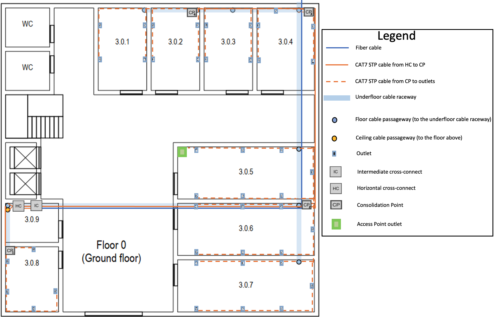

---

### **Building 3 Floor 1**
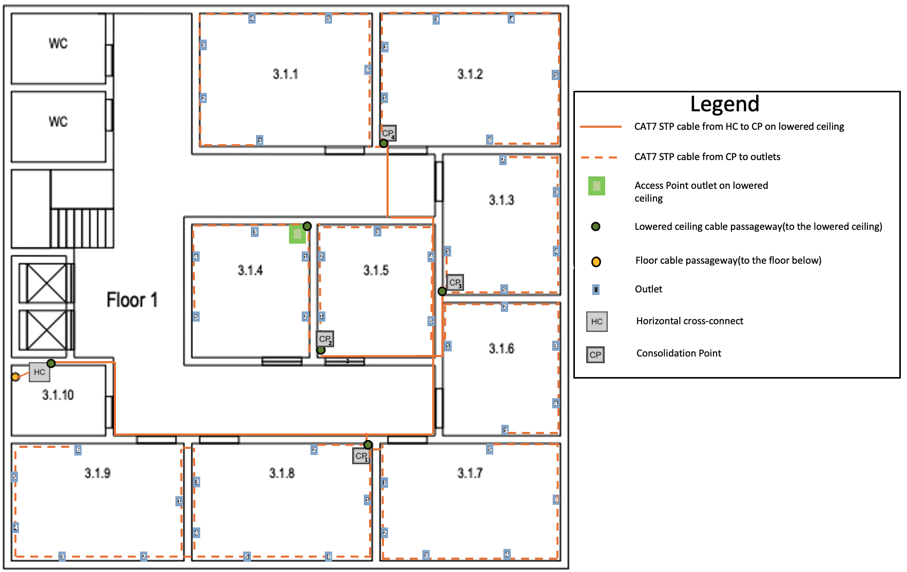

---
# Cable Calculation 

* The cable length measurements were made with the tool referenced in the general information and the calculation needed was made with the Excel file also referenced in the general information.
Cable redundancy was applied on the cables from the Main Cross-Connect to the Intermediate Cross-Connect and from the Horizontal Cross-Connect to the Consolidation Points. 

* The cables from the Main Cross-Connect to the Intermediate Cross-Connect have a redundancy of 1, meaning, there is 1 extra cable for redundancy. This means that from the Main Cross-Connect to the Intermediate Cross-Connect there are 2 cables.

* The cables from the Horizontal Cross-Connect to each Consolidation Point have a redundancy of 2, meaning, there is 2 extra cables for redundancy. This means that from the Horizontal Cross-Connect to each Consolidation Point there are 3 cables.

**Guide for the cable calculations table**:

**Source**: Source point 

**Destination**: Destination Point

**Height Multiplier**: Height factor for how much the cable has to go downwards or upper wards in order to reach the desired destination

**Room Common Point**: The distance between the destination and common point that the cable has to fulfill.

**Distance**: The actual distance the cable has to fulfill.

**Cable Multiplier**: The number of cables that cover the previous distance’s specified. This is where the redundancy is specified.

**Total(cm)**: Total amount of distance for the cable 

---
### Floor 0
---
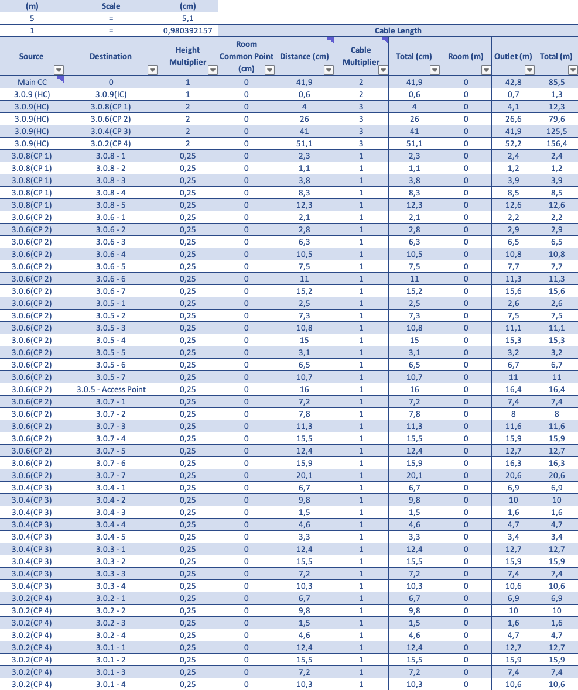

---
### Floor 1
---
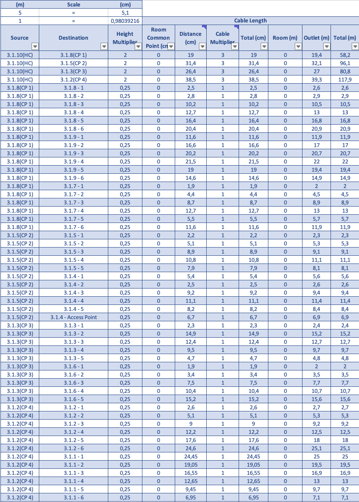

---
## Total cable needed for the building
---
* Overall cable needed to cover every outlet in the building
* There should be an extra 10/20% cable accounted for

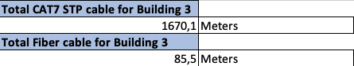

---
# Equipment Used 
---
### Building 3 Consolidation Points

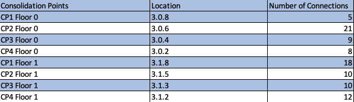

## Building 3 Total equipment
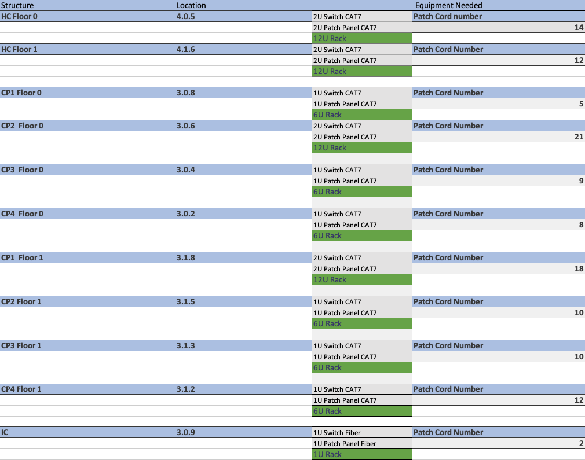

* The use of 12U Racks, 2U Switchs and 2U Patch panels when the connection limit isn't reached is to be able to provide extendibility to the overall structure.

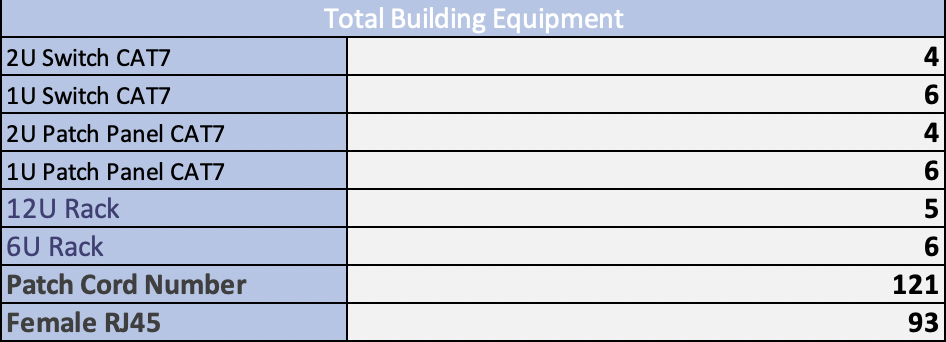