# RCOMP 2021-2022 Project - Sprint 1 - Building 4 - 1181544
===========================================

## Analysing Steps for Building 4
* [General Information](#general-information)
* [Analyse base buidling](#building-analysis)
* [Take measurements of both floors](#building-4-measurements)
* [Decide where all equipment should be placed in the building](#equipment-placing-building-4)
* [Represent the cable structure in the planning images](#cable-structure-building-4)
* [Cable calculation](#cable-calculation)
* [Equipment used](#equipment-used)

---
# **General Information** 

###  Measure Tool

* [ginifab - Virtual ruler on your image](https://www.ginifab.com/feeds/cm_to_inch/virtual_ruler_on_your_image.html) - The images used to measure are these, [Floor 0](building4_Floor0.png) and [Floor 1](building4_Floor1.png).

### Calculations Made

* All calculations were made with an excel sheet in order to facilitate the proccess in case there's a need to change any information about the plant and equipment needed [calculations file](building4_Measurements.xlsx).

### Scale used

* This scale was also calculated using te excel sheet with the ginifab webApp as reference.

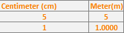

---

# **Building analysis** 

Building 4 floor is a 2 floor building each with 7 rooms plus 2 WC varying their sizes since the rooms aren't simetrical we need to measure almost every room to collect the needed.

### Floor 0
---

* As we can see from the image floor 0 has 7 rooms (ranging from 4.0.1 to 4.0.7) and is indicated to us that room 4.0.5 is the designated storage room;
* Since the ceiling cable passage way is also in the storage room that's where we will be storing our IC and HC equipment;
* We will need to pass the connection coming from the datacenter through room 4.0.4, using the underfloor passageway which will then go through the floor 0 hallway entering room 4.0.6 before finally reaching the storage room 4.0.5;

### Floor 1
---

* As well as we meantioned in floor 0 this floor also has 7 rroms (ranging from 4.0.1 to 4.0.7) and this in this floor the designated storage room is 4.1.6 which receives the needed cabled from the floor below;
* It is meantioned that this upper floor as a removable ceiling with 0.5 meters of space, which we will make use to pass our cables between rooms and hallway;
* We can visually see that the rooms on this floor are larger in size that the floor above so we can expect to use more consolidation points on this floor in order to save on cable length and possible maintainence needed;

---

# **Building 4 Measurements** 
**All the calculations here presented are in the Excel sheet**

The amount of outlets needed per room is calculated using the rule meantioned in the class's pdf that says, " there should be at least 2 outlets each 10m²".

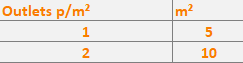

### Floor 0
---
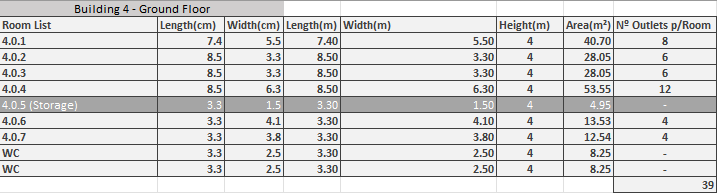

* As it is possible to see from the table above we will to use a couple os consolidation points on this floor in order to comply with the requirements.

### Floor 1
---
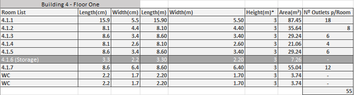

* As we can see from the table above, if we compare this floor with floor 0 we will verify that the room's areas are bigger (on average) which means we will need considerably more outlets to fulfill the requirements.

---

# **Equipment placing Building 4** 

* The positioning of the outlets throughtout all the rooms in the building take account of the rule that there's shouldn't be a point larger than 3 meters within a room without an outlet.

* This building equipment will be represented in the following way:

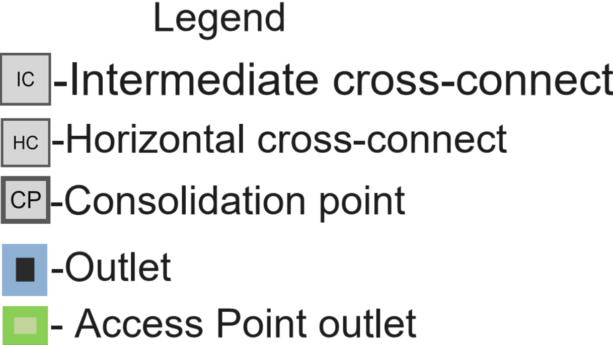

* The difference between the Horizontal cross-connects used in the building will be a number attatched to it (e.g. HC1, HC2). The same strategy will be used for the Consolidation points. 

### **Building4 Floor 0**
---
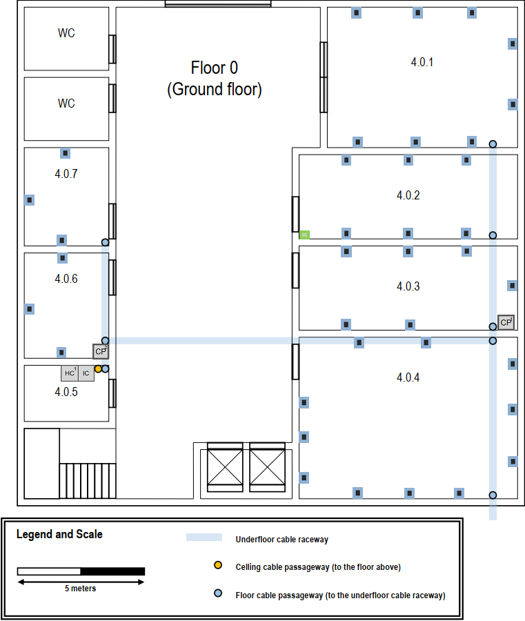

* The consolidation point 1 ( Located in room 4.0.6) is positioned in the corner of the room, and it will be it's real position, but when we will be explaining the cable positioning it will be moved slightly to the left so it easier to understand where are the cabling goes.

* The Access point outlet in be placed in the corner of room 4.0.2 in order to achieve a bigger Wi-Fi range within the building. Since it will placed in the ceiling it shouldn't stop the door from functioning properly.

* Since this is our floor 0 it mean it will receive it's connection from outside, meaning that it will also house it's Intermidiate cross-connect, which, itself will be placed in the storage room, room 4.0.5. Which means that the fiber cable will have to cross room 4.0.4, 4.0.6 and the hallway to reach the storage room.

* Consolidation point 1 will be located in room 4.0.6 and it will be used to feed the outlets of room's 4.0.6 and 4.0.7 making a total of 6 connections.

* Consolidation point 2 will be located in room 4.0.3 and it will be used to feed the outlets of room's 4.0.4, 4.0.3, 4.0.2 and 4.0.1 making a total of 30 connections plus the access point outlet.

* The storage it's also where is located the cable passageway between both building floors.

* This floor will have a total of 35 outlets plus one dedicated for the access point.

### **Building4 Floor 1**
---
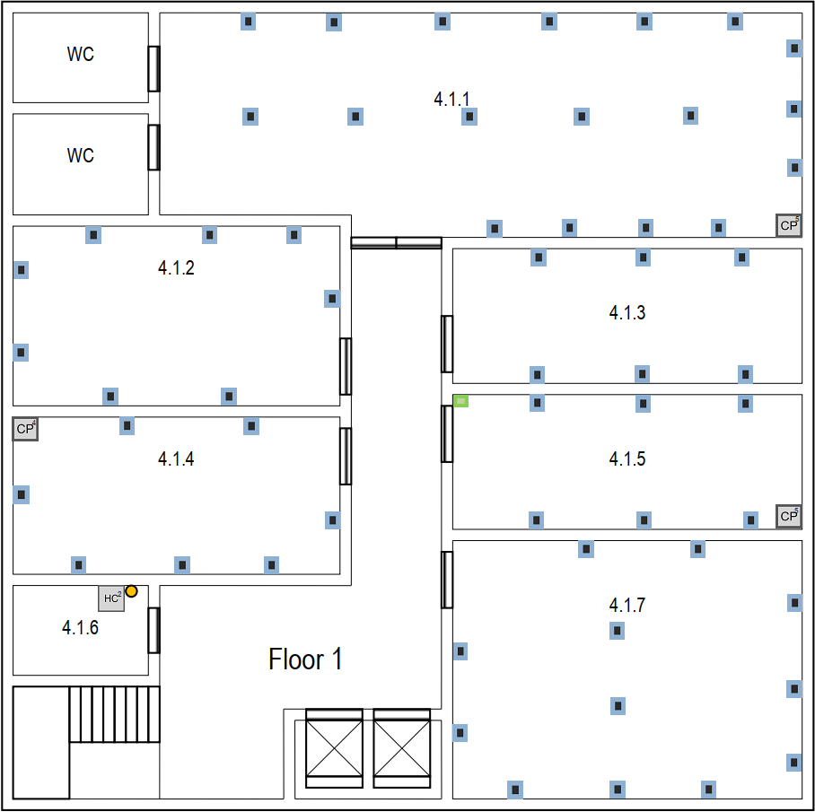

* The Access point outlet in be placed in the corner of room 4.1.5 in order to achieve a bigger Wi-Fi range within the building. Since this floor as a removable ceiling with 0.5 meters of height then we will be storing the access point there.

* This floor receives it's connection throught a floor cable passageway in the storage room (4.1.6) therefore thats where we will be storing our Horizontal cross-connect.

* This floor has the same number of rooms as the floor0 but the rooms are bigger, so we will need to use more consolidation points in order to proper distribuite cable to all the needed outlets.

* It will be placed a consolidation point (CP3) in room 4.1.4 and it will feed connections to that room and room 4.1.2 making a total of 14 connections.

* It will be placed a second consolidation point (CP4), on this floor, in room 4.1.5 which will feed connections to room's 4.1.5 and 4.1.7 making a total of 17 connections plus the access point located in 4.1.5.

* It will also be placed a third consolidation points (CP5) on this floor in room 4.1.1 which will feed room's 4.1.3 and 4.1.1 making a total of 23 connections.

* Both rooms 4.1.7 and 4.1.1 will need to have floor raceways in order to follow the rule of having at least one outlet every 3 meters.

* This floor will have a total of 52 outlets plus one dedicated for the access point.

---
# **Cable Structure Building 4** 
--- 

The cabling in this building will be represented the following way:
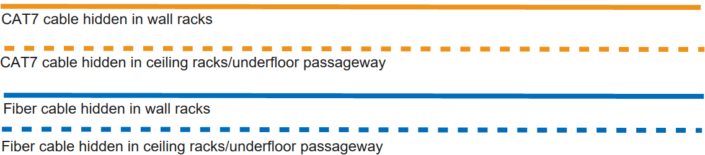

---

* Every cabled is represented in the image, as requested.

* Cables connecting the Horizontal cross-connect to the consolidation point are represented in a single line but they are thicker than the rest of the cables.

* Cross connect 1 located in room 4.0.6 in this representation is not in the right position in order to facilitate the cabling structure. It's real position is in the corner of the room.

* There should be at least one consolidation point for each two rooms. Therefore we ended up with 6 consolidation points total.

* All outlets should be connected through a consolidation point and never from a horizontal cross-connect.

---
### **Building4 Floor 0**
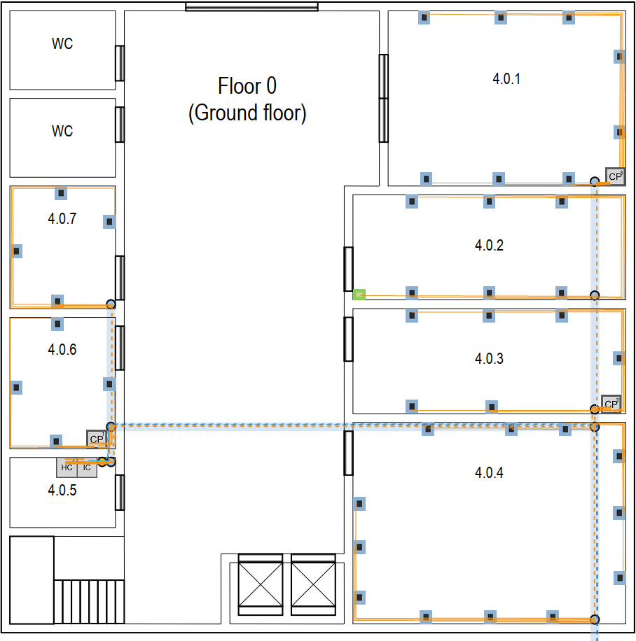

---

### **Building4 Floor 1**
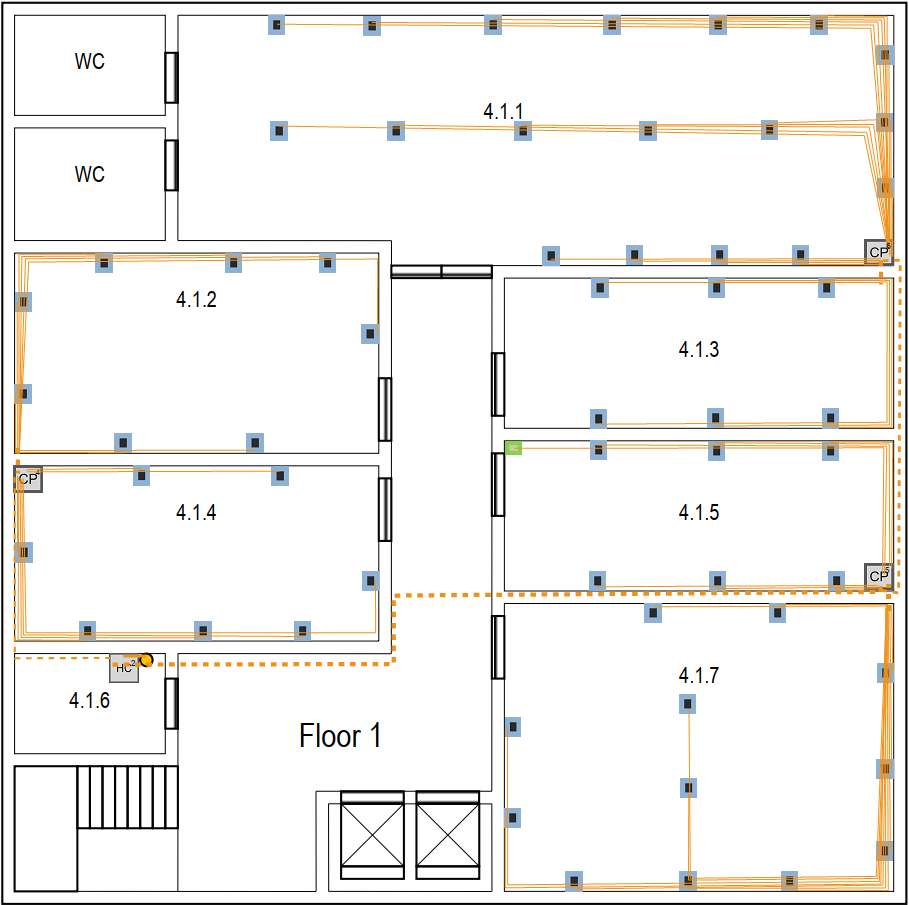

---
# Cable Calculation 

* The cable length measurements were made with the tool referenced in the general information and the calculation needed was made with the Excel sheet also referenced in the general information.

* The height of each floor was taken account which means
    * in floor 0 an extra 1 meter of cable will be used from the floor passageway until the wall's raceway is reached;
    * in floor 1 an extra 1.5 meter of cable will be used from the ceilling to the wall's raceway.

---
### Floor 0
---
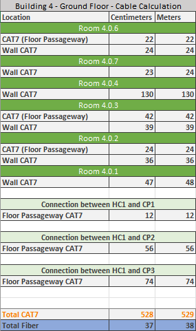

---
### Floor 1
---
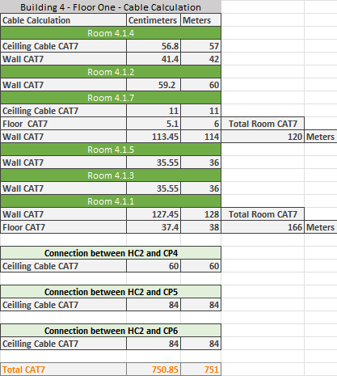

---
## Total cable needed for the building
---
* Overall cable needed to cover every outlet in the building
* There should be an extra 10/20% cable accounted for

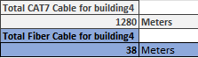

---
# Equipement Used 
---
 ### Building 4 Consolidation Points
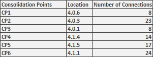

## Building 4 Total equipment
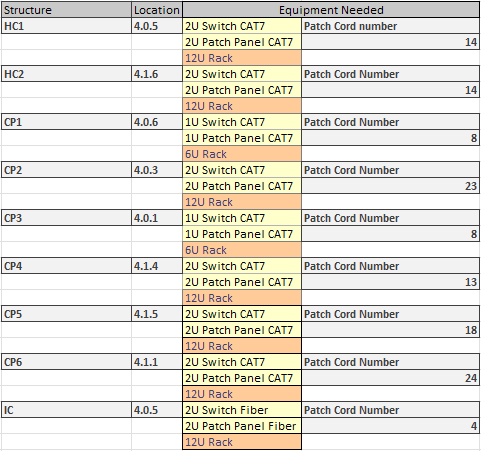

* The use of 12U Racks, 2U Switchs and 2U Patch panels when the connection limit isn't reached is to be able to provide extendebility to the overall structure.

* Since are only using the number of patch cords which are used by outlets then the number of Patch cords and Female RJ45 is the same.

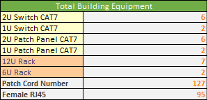