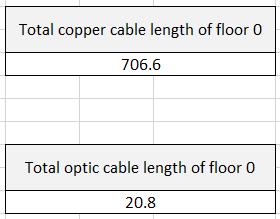

# RCOMP 2021-2022 Project - Sprint 1 - Building 5 - 1181654

## **Steps To Be Taken**
- Analyse the building
- Calculate rooms areas
- Calculate the number of outlets
- Verify outlets required for wi-fi 802.11 coverage
- Place outlets for wired connection, as well as outlets for connecting the wi-fi access point
- Calculate the length of cable needed
- Calculate dimensions of horizontal cross-connector (sizes of switches, patch panels, and routers)
- Summary of general inventory of building

---

## **Building 5 analysis**

#### Floor 0

In floor 0, the telecom room will be 5.0.2, and cables must traverse the rooms through the underground cable raceway.
The telecom room will house the IC and HC.
Fiber cable will come to 5.0.2 from outside the building through the underground cable raceway.
WC rooms do not require outlets.
The cables may travel through the underground cable raceway, only exiting through a single point in a room where it will travel through a wall fixed raceway 1 meter above the floor, where the outlets may be mounted.
IC, HC, CP equipment will be mounted 1.5 meters above the floor if their size allows it.

#### Floor 1

In floor 1, the telecom room will be 5.1.9, and cables must traverse rooms through the lowered ceiling.
The telecom room will house the HC.
WC rooms do not require outlets.
The cables may travel through the lowered ceiling, only exiting through a single point in a room where it will travel through a wall fixed raceway 1 meter above the floor, where the outlets may be mounted.
IC, HC, CP equipment will be mounted 1.5 meters above the floor if their size allows it.

___
### Dimensions and number of outlets

####  Measure Tool

[ginifab - Virtual ruler on your image](https://www.ginifab.com/feeds/cm_to_inch/virtual_ruler_on_your_image.html) - The images used to measure was the "Plant_To_Measure" in [Floor 0](./assets/Building_5_F00.png) and [Floor 1](./assets/Building_5_F01.png)

#### Scale

#### Building 5 measures floor 0

#### Building 5 measures floor 1

The rule used to calculate the number o outlets is of 1 outlet per 5m^2.
Given the ammount of outlets per floor, consolidation points will be used to manage these.

___

### Placement of outlets, CI, CH, CP, and wiring

#### Floor 0

IC and HC will be housed in the same rack even though the image represents them separately.
Given the range radius of 25m, one access point is enough to cover the entire floor, and will be placed in the middle of this floor (this is not taking into account the decrease in signal through walls).
The outlets in room 5.0.1 will be placed on the ground to account for the 3 meter rule, and their cables run under a floor cable cover. 

#### Floor 1

Given the range radius of 25m, one access point is enough to cover the entire floor, and will be placed in the middle of this floor (this is not taking into account the decrease in signal through walls).

---

## Cable length calculation

* The cable length measurements were made with the tool referenced in the general information and, the calculation needed were made with the Excel sheet in the attachments folder.
* The tables below are a summary of the calculations in the excel file.

* The height of each floor was taken account, which means:
    * in floor 0, an extra 1 meter of cable will be used from the floor passageway until the wall's raceway is reached;
    * in floor 0, an extra 1.5 meter of cable will be used from the IC/HC to take into account the handling of the wiring;
    * in floor 1, an extra 1.5 meter of cable will be used from the ceiling to the wall's raceway.
    * in floor 1, an extra 1 meter of cable will be used from the IC/HC to take into account the handling of the wiring;

* The cable redundancy for MC/IC is of two cables (x2).
* The cable redundancy for IC/HC is of three cables (x3).
* The cable redundancy for HC/CP is of three cables (x3).
* The length from MC to IC refers to the length of cable from the point just outside the building to the IC.

#### Floor 0

##### Cable used to connect key equipments

##### Cable used to connect cp to outlets

##### Total cable for floor 2

#### Floor 1

##### Cable used to connect key equipments

##### Cable used to connect cp to outlets

##### Total cable for floor 1

### Total cable needed for the building
---
* Overall CAT7 cable needed to cover every outlet in the building is 1428.1m
* Overall optic cable needed to cover every outlet in the building is 20.8m
* Adding 20% for error will make 1714m for CAT7 and 25m for optic.

### Building 5 Consolidation Points

* **CP (5.0.6)** require 1 (2U) patch patch panel with 48 connections, requiring a 12U size rack.
* **CP (5.0.9)** require 1 (2U) patch patch panel with 48 connections, requiring a 12U size rack.
* **CP (5.1.2)** require 1 (2U) patch patch panel with 48 connections, requiring a 12U size rack.
* **CP (5.1.6)** require 1 (2U) patch patch panel with 48 connections, requiring a 12U size rack.

## Building 5 Total equipment

* The use of 12U Racks, 2U Switchs, and 2U Patch panels when the connection limit isn't reached is to be able to provide extendability to the overall structure.

* The amount of RJ45 male connectors is not accounted for, as the patch cords are expected to be pre-built.

