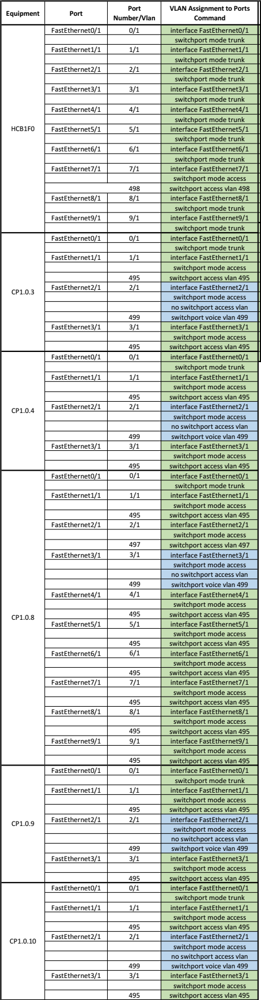
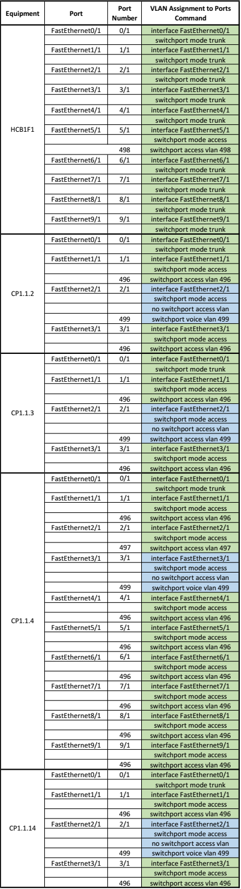
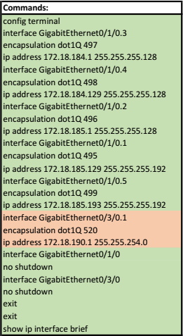

# RCOMP 2021-2022 Project - Sprint 2 - Building 1 - 1151399
===========================================

# COMMANDS USED

## Adding VLANs to the server Switch

| Command Config VLANs |
| -------------------- |
| vlan 495             |
| name B1F0            |
| vlan 496             |
| name B1F1            |
| vlan 497             |
| name B1WF            |
| vlan 498             |
| name B1DMZ           |
| vlan 499             |
| name B1VIP           |
| vlan 500             |
| name B2F0            |
| vlan 501             |
| name B2F1            |
| vlan 502             |
| name B2WF            |
| vlan 503             |
| name B2DMZ           |
| vlan 504             |
| name B2VIP           |
| vlan 505             |
| name B3F0            |
| vlan 506             |
| name B3F1            |
| vlan 507             |
| name B3WF            |
| vlan 508             |
| name B3DMZ           |
| vlan 509             |
| name B3VIP           |
| vlan 510             |
| name B4F0            |
| vlan 511             |
| name B4F1            |
| vlan 512             |
| name B4WF            |
| vlan 513             |
| name B4DMZ           |
| vlan 514             |
| name B4VIP           |
| vlan 515             |
| name B5F0            |
| vlan 516             |
| name B5F1            |
| vlan 517             |
| name B5WF            |
| vlan 518             |
| name B5DMZ           |
| vlan 519             |
| name B5VIP           |
| vlan 520             |
| name B1BBC           |

## Configuring other Switches as Clients

| Command VTP        |
| ------------------ |
| enable             |
| configure terminal |
| vtp mode client    |
| exit               |
| exit               |

## Assigning a VLAN to its port

### Main and Intermediate Cross Connect

### Horizontal Cross Connect and Floor 0 Consolidation Points

### Horizontal Cross Connect and Floor 1 Consolidation Points

### Sub interface configuration for DHCP assignment

As for the DHCP pool, it can be found [here](Configs\dhcpPool.txt). 