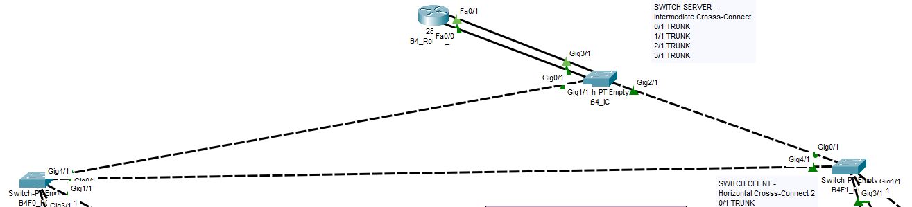

# RCOMP 2021-2022 Project - Sprint 2 - Building 4 - 1181544
===========================================

## Analysing Steps for Building 4

* [General Information](#general-information) 
* [Layer 2 Configuration](#layer-2-configuration) 
* [Layer 3 Configuration](#layer-3-configuration) 

---
## General Information 
* Packet Tracer Version 
    8.1.1.0022
* Device naming
    My devices follow this naming convention:
    * Building Name/Number - B4
    * Floor the device is on - F0/F1
    * And type of device - IC/Router/HC/CP/PC/DMZ/VOIP
    Every keyword will be seperated by _ .

## Layer 2 Configuration 
* Every cross-connect and consolidation point is represented in the Packt tracer file with their correct name and position. So for building 4 is to be expected the repsentation of CP1 to CP3 in the floor 0 section (to the left) and CP4 to CP6 in the floor 1 section (to the right).

* The cable type will also match the ones settled in the previous sprint. Fiber between Intermidiate cross-connects and Copper for everything else.

* Redundant cable link are also used as it is shown in the image below

### Virtual Lans

To make the work easier for us we decided to group all the VLANS and ips configuration in our planning markdown file.

These are the designated VLANS and it's IDS for Building 4

| Building | Ground Floor|    Floor 1  | Wi-Fi       | DMZ         | Voip        |   Backbone  |
  | :------: | :---------: | :---------: | :---------: | :---------: | :---------: | :---------:             |
  | 4        | B4F0 - 510  | B4F1 - 511  | B4WF - 512  | B4DMZ - 513 | B4VIP - 514 | B1BBC - 520        

### VLAN VTP configuration

Our team decided to call our domain **rc22nag2** so we all have the same domain throughtout our entire infractructure including our backbone.

We also made sure that our Server Switchs had all the infractructure VLANS saved as it was stated as a requirment.

Building 4 has it's Intermediate Cross-connect switch as a Server Switch and the other switches (Horizontal Cross-connect and Consolidation points) are clients of that server switch.

## Layer 3 Configuration 

### IPv4 Configuration

In order to facilitate our work we stabelished our IPv4 configurations together as a team and therefore we have the whole building ip configuration in our planning markdown file as well.

The following table has the number of Hosts needed for Building 4 and backbone:

  | Building | Hosts Needed | Hosts Available | Subnet Address  | Mask          |      
  | :------: | :---------:  | :-------------: | :-------------: | :-----------: | 
  | 4        | 175          | 254             | 172.18.188.0/24 | 255.255.255.0	|
  |Backbone  | 120          | 512             | 172.18.190.0/23 | 255.255.254.0	|

### Building 4 IPv4 Configuration
 **172.18.188.0/24**

 The following table has the network IPs for each VLAN needed for Building 4:

  | VLAN  | Hosts Needed | Subnet Address    |  Mask           | Hosts Available |
  | :---- | :----------: | :---------------- | :-------------: | :-------------: |
  | B4WF  | 70           | 172.18.188.0/25   | 255.255.255.128 | 126             |
  | B4F1  | 55           | 172.18.188.128/26 | 255.255.255.192 | 62              |
  | B4F0  | 28           | 172.18.188.192/27 | 255.255.255.224 | 30              |
  | B4VIP | 12           | 172.18.188.224/28 | 255.255.255.240 | 14              |
  | B4DMZ | 10           | 172.18.188.240/28 | 255.255.255.240 | 14              |

## Router and Static Routing

Even though it wasn't a requirement, our team decided to configure DHCP pools for each of our VLANS so we could avoid mistakes assigning IPs to our machines and also known Packet Tracers bugs.