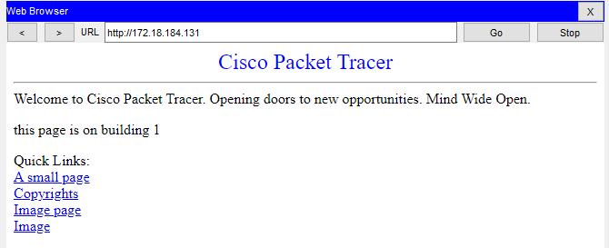

# RCOMP 2021-2022 Project - Sprint 3 - Building 1 - 1151399
===========================================

## Objectives for Building 1

* [General Information](#general-information)
* [1. OSPF](#ospf)
* [2. HTTP servers](#http)
* [3. DHCPv4 service](#dhcp)
* [4. VoIP service](#voip)
* [5. DNS](#dns)
* [6. NAT (Network Address Translation)](#nat)
* [7. Static Firewall (ACLs)](#acl)

---
## General Information 
* Packet Tracer Version 
    8.1.1.0022

todo: details specific to my building    
* Device naming:
    - B1_HTTP (building 1 HTTP server) 
    - B1_DNS (building 1 DNS server) 

* Static IPs of servers:
    - DNS `172.18.184.130`
    - HTTP `172.18.184.131`

## 1. OSPF dynamic routing 

To implement dynamic routing (OSPF), each building will be assigned an area, and the backbone another area which must be of id 0.
The building are assigned their respective area id, found in the planning document.
Building 1 OSPF id is 1.

**Scripts used**

(Building 1, IC router)

        enable
        config terminal
        router ospf 1
        network 172.18.184.0 0.0.1.255 area 1
        network 172.18.190.0 0.0.1.255 area 0
        exit
        exit

(Backbone, MC router)

        enable
        config terminal
        router ospf 1
        network 172.18.184.0 0.0.1.255 area 1
        network 172.18.186.0 0.0.0.255 area 2
        network 172.18.187.0 0.0.0.255 area 3
        network 172.18.188.0 0.0.0.255 area 4
        network 172.18.189.0 0.0.0.255 area 5
        network 172.18.190.0 0.0.1.255 area 0
        exit
        exit

## Routing tables of the IC and MC:

## 2. HTTP servers 

A server was added with the HTTP service enabled

And applied the following settings: 

Default gateway:
`172.18.184.129`

DNS server:
`172.18.184.130`

Server IP and mask:
`172.18.184.131 255.255.255.128`

## 3. DHCPv4 service 

A script was created and run in the building 1's router (IC) that, applies DHCP to all networks of building 1 except for DMZ network.
This script also takes into account the need to set "option 150" for VOIP networks, as well as the default IP address of the DNS server.

        config terminal
        ip dhcp pool VLANB1F0
        network 172.18.185.128 255.255.255.192
        default-router 172.18.185.129
        ip dhcp excluded-address 172.18.185.129 172.18.185.129
        ip dhcp pool VLANB1F1
        network 172.18.185.0 255.255.255.128
        default-router 172.18.185.1
        ip dhcp excluded-address 172.18.185.1 172.18.185.1
        ip dhcp pool VLANB1WF
        network 172.18.184.0 255.255.255.128
        default-router 172.18.184.1
        ip dhcp excluded-address 172.18.184.1 172.18.184.1
        ip dhcp pool VLANB1VIP
        network 172.18.185.192 255.255.255.192
        default-router 172.18.185.193
        option 150 ip 172.18.185.193
        ip dhcp excluded-address 172.18.185.193 172.18.185.193
        ip dhcp pool VLANB1BBC
        network 172.18.190.0 255.255.254.0
        default-router 172.18.190.1
        ip dhcp excluded-address 172.18.190.1 172.18.190.1
        exit
        exit

## 4. VoIP service 

To allow the addition of VOIP phones and the communication across buildings of the campus, the following steps were taken:

### a). In the switch to which the phone is connected, set the VOIP packet encapsulation format to Layer 2 CoS priority value.

        config terminal
        interface Fa8/1
        switchport mode access
        switchport voice vlan 499
        no switchport access vlan
        exit
        exit

### b). In the IC router set option 150 to DHCP for the VOIP Vlan.

(**note**: the following script is an example, the changes have already been added in the DHCP script) 

        config terminal
        ip dhcp excluded-address 172.18.185.193 172.18.185.193
        ip dhcp pool VLANB1VIP
        default-router 172.18.185.193
        option 150 ip 172.18.185.193
        network 172.18.185.192 255.255.255.192
      
### c). In the IC router, set automatic phone registration for 1 to 4 devices

        enable
        config terminal
        telephony-service
        max-ephones 4
        max-dn 4
        ip source-address 172.18.185.193 port 2000
        auto assign 1 to 4
        ephone-dn 1
        number 1001
        ephone-dn 2
        number 1002
        ephone-dn 3
        number 1003
        ephone-dn 4
        number 1004
        exit
        exit

### d). In the IC router Configure phone call forwarding to the other campus buildings 

        enable
        config terminal
        dial-peer voice 12 voip
        destination-pattern 2...
        session target ipv4:172.18.190.2
        dial-peer voice 13 voip
        destination-pattern 3...
        session target ipv4:172.18.190.3
        dial-peer voice 14 voip
        destination-pattern 4...
        session target ipv4:172.18.190.4
        dial-peer voice 15 voip
        destination-pattern 5...
        session target ipv4:172.18.190.5
        exit
        exit

## 5. DNS 

A server was added with the DNS service enabled, and applied the following:

### 5.0. Applied the settings: 

default gateway:
`172.18.184.129`

DNS server:
`172.18.184.130`

server ip and mask
`172.18.184.130
255.255.255.128`

### 5.1. Added NS (Name Server) records and glue records

(applied in the DNS service UI in the DNS server)

        (NS record) building-1.rcomp-21-22-na-g2     ns.building-1.rcomp-21-22-na-g2 
        (A record) ns.building-1.rcomp-21-22-na-g2     172.18.184.130

        (NS record) building-2.rcomp-21-22-na-g2     ns.building-2.rcomp-21-22-na-g2 
        (A record) ns.building-2.rcomp-21-22-na-g2     172.18.186.226

        (NS record) building-3.rcomp-21-22-na-g2     ns.building-3.rcomp-21-22-na-g2 
        (A record) ns.building-3.rcomp-21-22-na-g2     172.18.187.194

        (NS record) building-4.rcomp-21-22-na-g2     ns.building-4.rcomp-21-22-na-g2 
        (A record) ns.building-4.rcomp-21-22-na-g2     172.18.188.242

        (NS record) building-5.rcomp-21-22-na-g2     ns.building-5.rcomp-21-22-na-g2 
        (A record) ns.building-5.rcomp-21-22-na-g2     172.18.189.226

### 5.2. Added other DNS records

(applied in the DNS service UI in the DNS server)

        http (A record)     server1.building-1.rcomp-21-22-na-g2    172.18.184.131
        www (CNAME)         www.building-1.rcomp-21-22-na-g2        server1.building-1.rcomp-21-22-na-g2
        web (CNAME)         web.building-1.rcomp-21-22-na-g2        server1.building-1.rcomp-21-22-na-g2
        dns (CNAME)         dns.building-1.rcomp-21-22-na-g2        ns.building-1.rcomp-21-22-na-g2

### 5.3. Set DNS clients’ configuration (end-nodes)

Already set on [3. DHCPv4 service](#dhcp) by setting the default DNS server.

      dns-server 172.18.184.130

## 6. NAT (Network Address Translation) 
The NAT was applied to the Backbone router (MC), and was only in order to translate outside traffic into the local HTTP and DNS servers.

### HTTP, HTTPS uses TCP on ports 80 and 443:

        config terminal
        interface Gig0/0/0
        ip nat inside
        interface Gig0/2/0
        ip nat outside
        ip nat inside source static tcp 172.18.184.131 80 15.203.48.169 10011
        ip nat inside source static tcp 172.18.184.131 443 15.203.48.169 10012
        exit

### DNS uses UDP and TCP on port 53:

        config terminal
        ip nat inside source static tcp 172.18.184.130 53 15.203.48.169 10013
        ip nat inside source static udp 172.18.184.130 53 15.203.48.169 10013
        exit

## 7. Static Firewall (ACLs) 
The ACLs were applied to the Building 1 router (IC), and abiding to the rules requested, below there are notes to the right side of the script refering the number 1 to 5 and what it accomplishes.

| Command                                                                           | objective                            |
| --------------------------------------------------------------------------------- | ------------------------------------ |
| #In                                                                               | \-                                   |
| enable                                                                            | \-                                   |
| config terminal                                                                   | \-                                   |
| no access-list 151                                                                | \-                                   |
| access-list 151 permit ip 172.18.184.0 0.0.1.255 any                              | 1 block internal spoofing            |
| access-list 151 permit icmp any any echo                                          |  2 allow all icmp requests           |
| access-list 151 permit icmp any any echo-reply                                    |  2 allow all icmp responses          |
| access-list 151 deny ip any 172.18.184.129 0.0.0.128                              |  3 block access to dmz               |
| access-list 151 permit udp 172.18.184.129 0.0.0.128 any eq 53                     |  3 allow access to dmz through DNS   |
| access-list 151 permit tcp 172.18.184.129 0.0.0.128 any eq 53                     |  3 allow access to dmz through DNS   |
| access-list 151 permit tcp 172.18.184.129 0.0.0.128 any eq 80                     |  3 allow access to dmz through HTTP  |
| access-list 151 permit tcp 172.18.184.129 0.0.0.128 any eq 443                    |  3 allow access to dmz through HTTPS |
| access-list 151 permit udp 172.18.184.0 0.0.0.0 any eq 67                         |  4 allow DHCP server                 |
| access-list 151 permit udp any 172.18.184.0 0.0.0.0 eq 68                         |  4 allow DHCP client                 |
| access-list 151 permit tcp 172.18.185.193 0.0.0.64 any eq 2000                    |  5 allow voip out                    |
| access-list 151 permit udp 172.18.185.193 0.0.0.64 any eq 2000                    |  5 allow voip out                    |
| interface GigabitEthernet 0/0/0                                                   | \-                                   |
| ip access-group 151 in                                                            | \-                                   |
| exit                                                                              | \-                                   |
| exit                                                                              | \-                                   |
| #Out                                                                              | \-                                   |
| config terminal                                                                   | \-                                   |
| no access-list 152                                                                | \-                                   |
| access-list 152 deny ip 172.18.184.0 0.0.1.255 any                                |  1 block external spoofing           |
| access-list 152 permit ip any any                                                 | 1 and 5 allow other                  |
| access-list 152 permit icmp any any echo                                          |  2 allow all icmp requests           |
| access-list 152 permit icmp any any echo-reply                                    |  2 allow all icmp responses          |
| access-list 152 permit ospf 172.18.190.0 0.0.1.255 172.18.190.6 0.0.0.0           |  4 allow ospf                        |
| access-list 152 permit tcp 172.18.190.0 0.0.1.255 172.18.185.193 0.0.0.64 eq 2000 |  5 allow voip in                     |
| access-list 152 permit udp 172.18.190.0 0.0.1.255 172.18.185.193 0.0.0.64 eq 2000 |  5 allow voip in                     |
| interface GigabitEthernet 0/2/0                                                   | \-                                   |
| ip access-group 152 in                                                            | \-                                   |
| exit                                                                              | \-                                   |
| exit                                                                              | \-                                   |

