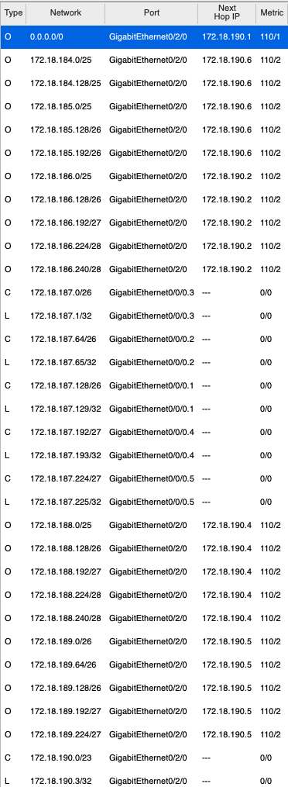
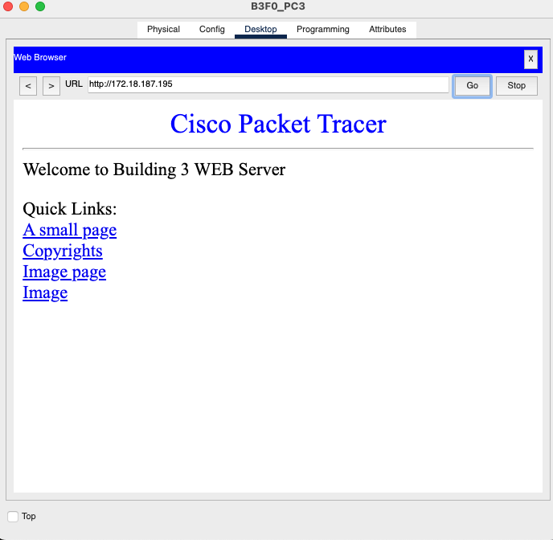
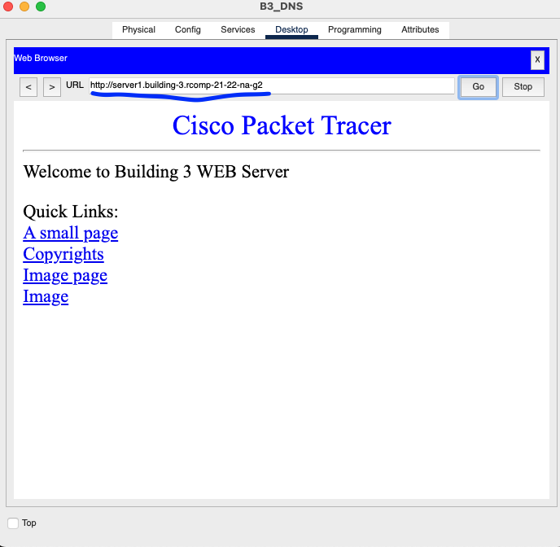

# RCOMP 2021-2022 Project - Sprint 3 - Building 3 - 1181357
===========================================

## Objectives for Building 3

* [General Information](#general-information)
* [1. OSPF](#ospf)
* [2. HTTP servers](#http)
* [3. DHCPv4 service](#dhcp)
* [4. VoIP service](#voip)
* [5. DNS](#dns)
* [6. NAT (Network Address Translation)](#nat)
* [7. Static Firewall (ACLs)](#acl)

---
## General Information 
* Packet Tracer Version 
    8.1.1.0022
  
* Device naming:

    - B3_HTTP (building 3 HTTP server) 
    - B3_DNS (building 3 DNS server) 

* Static IPs of servers:
    - DNS `172.18.187.194`
    - HTTP `172.18.187.195`

## 1. OSPF dynamic routing 

To implement dynamic routing (OSPF), each building will be assigned an area, and the backbone another area which must be of id 0.
The building are assigned their respective area id, found in the planning document.
Building 3 OSPF id is 3.

**Scripts used**

(Building 3, IC router)

        enable
        config terminal
        router ospf 1
        network 172.18.187.0 0.0.0.255 area 3
        network 172.18.190.0 0.0.1.255 area 0
        exit
        exit

## Routing tables with OSPF:

## 2. HTTP servers 

A server was added with the HTTP service enabled

And applied the following settings: 

Default gateway:
`172.18.187.193`

DNS server:
`172.18.187.194`

Server IP and mask:
`172.18.187.195 255.255.255.224`

## 3. DHCPv4 service 

A script was created and run in the building 3's router (IC) that applies DHCP to all networks of building 3 except for DMZ network.
This script also takes into account the need to set "option 150" for VOIP networks, as well as the default IP address of the DNS server.

        config terminal

        ip dhcp excluded-address 172.18.187.129 172.18.187.129
        ip dhcp pool VLANB3F0
        network 172.18.187.128 255.255.255.192
        default-router 172.18.187.129
        dns-server 172.18.187.194

        ip dhcp excluded-address 172.18.187.65 172.18.187.65
        ip dhcp pool VLANB3F1
        network 172.18.187.64 255.255.255.192
        default-router 172.18.187.65
        dns-server 172.18.187.194

        ip dhcp excluded-address 172.18.187.1 172.18.187.1
        ip dhcp pool VLANB3WF
        network 172.18.187.0 255.255.255.192
        default-router 172.18.187.1
        dns-server 172.18.187.194

        ip dhcp excluded-address 172.18.187.225 172.18.187.225 
        ip dhcp pool VLANB3VIP
        default-router 172.18.187.225 
        option 150 ip 172.18.187.225
        network 172.18.187.224 255.255.255.224
        exit
        exit

## 4. VoIP service 

To allow the addition of VOIP phones and the communication across buildings of the campus, the following steps were taken:

### a). In the switch to which the phone is connected, set the VOIP packet encapsulation format to Layer 2 CoS priority value.

        config terminal
        interface Fa5/1
        switchport mode access
        switchport voice vlan 509
        no switchport access vlan

### b). In the IC router set option 150 to DHCP for the VOIP Vlan.

(**note**: the following script is an example, the changes have already been added in the DHCP script) 

        ip dhcp excluded-address 172.18.187.225 172.18.187.225 
        ip dhcp pool VLANB3VIP
        default-router 172.18.187.225 
        option 150 ip 172.18.187.225
        network 172.18.187.224 255.255.255.224
      
### c). In the IC router, set automatic phone registration for 1 to 4 devices

        config terminal
        telephony-service
        max-ephones 4
        max-dn 4
        ip source-address 172.18.187.225 port 2000
        auto assign 1 to 4
        ephone-dn 1
        number 3001
        ephone-dn 2
        number 3002
        ephone-dn 3
        number 3003
        ephone-dn 4
        number 3004

### d). In the IC router Configure phone call forwarding to the other campus buildings 

        config terminal
        dial-peer voice 31 voip
        destination-pattern 6...
        session target ipv4:172.18.190.8
        dial-peer voice 32 voip
        destination-pattern 7...
        session target ipv4:172.18.190.9
        dial-peer voice 34 voip
        destination-pattern 8...
        session target ipv4:172.18.190.10
        dial-peer voice 35 voip
        destination-pattern 9...
        session target ipv4:172.18.190.11

## 5. DNS 

A server was added with the DNS service enabled, and applied the following:

### 5.0. Applied the settings: 

default gateway:
`172.18.187.193`

DNS server:
`172.18.187.194`

server ip and mask
`172.18.187.194
255.255.255.224`

### 5.1. Added NS (Name Server) records and glue records

(applied in the DNS service UI in the DNS server)

        (NS record) building-1.rcomp-21-22-na-g2 ns.building-1.rcomp-21-22-na-g2
        (A record) ns.building-1.rcomp-21-22-na-g2 172.18.184.130

        (NS record) building-2.rcomp-21-22-na-g2 ns.building-2.rcomp-21-22-na-g2
        (A record) ns.building-2.rcomp-21-22-na-g2 172.18.186.226

        (NS record) building-3.rcomp-21-22-na-g2 ns.building-3.rcomp-21-22-na-g2
        (A record) ns.building-3.rcomp-21-22-na-g2 172.18.187.194

        (NS record) building-4.rcomp-21-22-na-g2 ns.building-4.rcomp-21-22-na-g2
        (A record) ns.building-4.rcomp-21-22-na-g2 172.18.188.242

        (NS record) building-5.rcomp-21-22-na-g2 ns.building-5.rcomp-21-22-na-g2
        (A record) ns.building-5.rcomp-21-22-na-g2 172.18.189.226

### 5.2. Added other DNS records

(applied in the DNS service UI in the DNS server)

       http (A record)     server1.building-3.rcomp-21-22-na-g2    172.18.187.195
       www (CNAME)         www.building-3.rcomp-21-22-na-g2        server1.building-3.rcomp-21-22-na-g2
       web (CNAME)         web.building-3.rcomp-21-22-na-g2        server1.building-3.rcomp-21-22-na-g2
       dns (CNAME)         dns.building-3.rcomp-21-22-na-g2        ns.building-3.rcomp-21-22-na-g2

### 5.3. Set DNS clients’ configuration (end-nodes)

Already set on [3. DHCPv4 service](#dhcp) by setting the default DNS server.

      dns-server 172.18.187.194

### Accessing the HTTP server using DNS name

## 6. NAT (Network Address Translation) 
The NAT was applied to the Backbone router (MC), and was only in order to translate outside traffic into the local HTTP and DNS servers.

### HTTP, HTTPS uses TCP on ports 80 and 443:

        config terminal
        interface Gig0/0/0
        ip nat inside
        interface Gig0/2/0
        ip nat outside
        ip nat inside source static tcp 172.18.187.195 80 15.203.48.169 10031
        ip nat inside source static tcp 172.18.187.195 443 15.203.48.169 10032
        exit

### DNS uses UDP and TCP on port 53:

        config terminal
        ip nat inside source static tcp 172.18.187.194 53 15.203.48.169 10033
        ip nat inside source static udp 172.18.187.194 53 15.203.48.169 10033

        exit

## 7. Static Firewall (ACLs) 
The ACLs were applied to the Building 1 router (IC), and abiding to the rules requested, below there are notes to the right side of the script refering the number 1 to 5 and what it accomplishes.

| Command                                                                           | objective                            |
| --------------------------------------------------------------------------------- | ------------------------------------ |
| #In                                                                               | \-                                   |
| enable                                                                            |                                      |
| config terminal                                                                   |                                      | 
| no access-list 131                                                                |                                      | 
| access-list 131 permit ip 172.18.187.0 0.0.0.255 any                              | 1 block internal spoofing            |
| access-list 131 permit icmp any any echo                                          | 2 allow all icmp requests            |
| access-list 131 permit icmp any any echo-reply                                    | 2 allow all icmp responses           |
| access-list 131 deny ip any 172.18.187.192 0.0.0.31                               | 3 block access to dmz                |
| access-list 131 permit udp 172.18.187.192 0.0.0.31 any eq 53                      | 3 allow access to dmz through DNS    |
| access-list 131 permit tcp 172.18.187.192 0.0.0.31 any eq 53                      | 3 allow access to dmz through DNS    |
| access-list 131 permit tcp 172.18.187.192 0.0.0.31 any eq 80                      | 3 allow access to dmz through HTTP   |
| access-list 131 permit tcp 172.18.187.192 0.0.0.31 any eq 443                     | 3 allow access to dmz through HTTPS  |
| access-list 131 permit udp 172.18.189.0 0.0.0.0 any eq 67                         | 4 allow DHCP server                  |
| access-list 131 permit udp any 172.18.189.0 0.0.0.0 eq 68                         | 4 allow DHCP client                  |
| access-list 131 permit tcp 172.18.187.224 0.0.0.31 any eq 2000                    | 5 allow voip out                     |
| access-list 131 permit udp 172.18.187.224 0.0.0.31 any eq 2000                    | 5 allow voip out                     |
| interface GigabitEthernet 0/0/0                                                   |                                      |
| ip access-group 131 in                                                            |                                      |
| exit                                                                              |                                      |
| exit                                                                              |                                      |
| #Out                                                                              | \-                                   |
| config terminal                                                                   |
| no access-list 132                                                                |                                      |
| access-list 132 deny ip 172.18.187.0 0.0.0.255 any                                |  1 block external spoofing           | 
| access-list 132 permit any any                                                    |  1 and 5 allow other                 |
| access-list 132 permit icmp any any echo                                          |  2 allow all icmp requests           |
| access-list 132 permit icmp any any echo-reply                                    |  2 allow all icmp responses          |
| access-list 132 permit ospf 172.18.190.0 0.0.1.255 172.18.190.3 0.0.0.0           |  4 allow ospf                        | 
| access-list 132 permit tcp 172.18.190.0 0.0.1.255 172.18.187.224 0.0.0.31 eq 2000 |  5 allow voip in                     | 
| access-list 132 permit udp 172.18.190.0 0.0.1.255 172.18.187.224 0.0.0.31 eq 2000 |  5 allow voip in                     | 
| interface GigabitEthernet 0/2/0                                                   |                                      |
| ip access-group 132 in                                                            |                                      | 
| exit                                                                              |                                      |
| exit                                                                              |                                      | 

